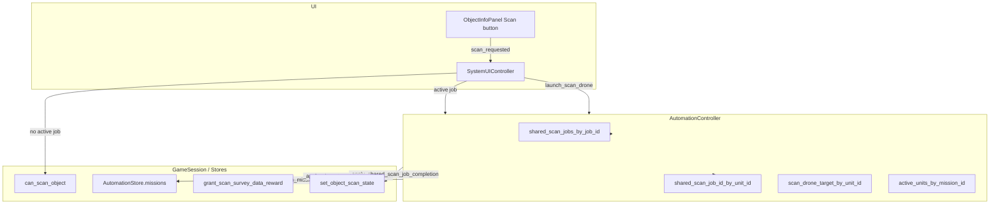

# SharedScanJob Architecture v0.1

**Date:** 2026-06-07  
**Engine:** Godot 4.6.1 / strictly typed GDScript  
**Status:** Source of truth for implemented SharedScanJob behavior (Steps 2–7, speed-scaling rollback included).

**Related audits:** `docs/audits/shared_scan_job_step_*_v0_1.md`  
**Cleanup context:** `docs/audits/full_project_cleanup_audit_v0_2.md` (SharedScanJob superseded v0.1 per-drone-only scan model)  
**Design plan:** `docs/design/shared_scan_job_multi_scan_drone_plan_v0_1.md`

---

## Purpose

### Why SharedScanJob exists

Before SharedScanJob, each ScanDrone scan was an isolated mission: arrival called `_complete_scan_mission()` directly with only a Step-3 guard against duplicate completion. That did not scale to **multiple ScanDrones on one target** because:

- A second drone could not join an in-progress scan without starting a **new** scan mission (blocked by `KEY_SCAN_ALREADY_IN_PROGRESS`).
- There was no single **completion owner** to ensure SurveyData and ScanState advanced **once** per scan layer attempt.
- Post-scan **support orbit** drones had no shared identity tying them to `system_id + target_id + target_scan_state`.

SharedScanJob introduces a **runtime job record** keyed by `(system_id, target_id, target_scan_state)` that:

1. Owns **one** scan completion (reward + ScanState) per job.
2. Tracks **multiple** assigned unit IDs (primary mission drone + assign-path drones).
3. Separates **primary completion** from **assigned support** behavior after Step 6.

### Primary scan mission vs support / assigned drones

| Role | How created | `AutomationStore` mission | On arrival | Scan reward / ScanState |
|------|-------------|---------------------------|------------|-------------------------|
| **Primary** | `launch_scan_drone()` → `create_scan_mission()` | Yes (`mission_id > 0`) | `_on_scan_drone_arrived_at_target` → `_process_shared_scan_job_arrival` → `_apply_shared_scan_job_completion` | **Once** via `_complete_scan_mission()` |
| **Assigned (during active job)** | `assign_scan_drone_to_shared_job()` (UI Scan button when job active) | **No** (`mission_id = 0`) | `_on_assign_scan_drone_arrived_at_target` → support orbit only | **Never** |
| **Support (post-completion)** | Primary (or assign) drone after job removed | Mission completed / none | `transfer_orbit_to_base(target)` | **Never** — mining yield bonus only |

**UI note:** Scan button label stays `"Scan"` (`SCAN_BUTTON_TEXT`). When a SharedScanJob is active, the same button calls `assign_scan_drone_to_shared_job()` instead of `launch_scan_drone()` (`system_ui_controller.gd` `_on_object_scan_requested`).

### Why completion must happen only once

`_complete_scan_mission()` (`automation_controller.gd`) performs side effects that must not stack per drone:

- `GameSession.set_object_scan_state()`
- `GameSession.grant_scan_survey_data_reward()`
- Resource reveal / mining init

Without SharedScanJob, multiple arrivals could duplicate rewards or ScanState bumps. The job flags `completion_applied` and `reward_given` enforce **at-most-once** completion per `job_id`.

---

## Runtime Ownership

### AutomationController (owner)

All SharedScanJob state lives on `AutomationController` (`scripts/system/controller/automation_controller.gd`):

| Field | Type | Purpose |
|-------|------|---------|
| `shared_scan_jobs_by_job_id` | `Dictionary` | Active job records keyed by `job_id` string |
| `shared_scan_job_id_by_unit_id` | `Dictionary` | `unit_instance_id → job_id` |

Related scan-drone maps (pre-existing, still authoritative for movement/save):

| Field | Purpose |
|-------|---------|
| `active_units_by_mission_id` | Primary scan missions only (`mission_id > 0`) |
| `scan_drone_target_by_unit_id` | Every drone's target body id (primary, assign, support) |
| `idle_drones` | Drones at home base |

Constants:

- `SHARED_SCAN_JOB_WORK_REQUIRED := 1.0` — placeholder progress ceiling (not scan-layer duration).
- `SHARED_SCAN_JOB_COMPLETION_OWNER := "shared_scan_job"` — telemetry/debug marker.

### GameSession / stores (not job owner)

| Concern | Owner | SharedScanJob interaction |
|---------|-------|---------------------------|
| Scan gates | `GameSession.can_scan_object()` | `target_has_active_scan` → `KEY_SCAN_ALREADY_IN_PROGRESS` blocks **new** `launch_scan_drone` |
| Mission records | `AutomationStore.missions` | Primary scan only; stores `target_scan_state`, `scan_is_progression` |
| SurveyData reward | `GameSession.grant_scan_survey_data_reward()` | Called only from `_complete_scan_mission()` inside `_apply_shared_scan_job_completion` |
| Mining support % | `GameSession.get_scan_drone_mining_yield_bonus_per_support_drone_percent()` | From active `scan_drone` `UpgradeDefinition` (default **2%** per support drone) |
| Scan duration (travel/work on unit) | `GameSession.get_scan_duration_seconds_for_target_state()` | Set on `AutomationUnit.work_duration` for outbound primary/assign — **not** used as SharedScanJob progress tick |

`AutomationStore` does **not** store SharedScanJob dicts. `GameSession` does **not** own `shared_scan_jobs_by_job_id`.

### Persisted vs reconstructed (Save v0.1)

| Data | Persisted? | Source on load |
|------|------------|----------------|
| `shared_scan_jobs_by_job_id` | **No** | Rebuilt at runtime |
| `shared_scan_job_id_by_unit_id` | **No** | Rebuilt from missions + target map |
| `automation.store.missions` | **Yes** | `AutomationStore.to_save_data()` / `apply_save_data()` |
| `scan_missions[]` runtime snapshot | **Yes** | `AutomationSaveService.build_scan_missions_array()` — unit pose, target, `mission_id`, `scan_reveal_done`, etc. |
| `scan_drone_target_by_unit_id` | **Yes** (via snapshot + restore) | Rehydrated when drones respawn |

**Rebuild entry points:**

- `_rebuild_shared_scan_jobs_from_active_scan_missions()` — from `active_units_by_mission_id` + store missions.
- `_sync_shared_scan_job_assignments_from_target_map()` — assign drones (`mission_id = 0`) from `scan_drone_target_by_unit_id`.
- `_validate_shared_scan_jobs_after_restore()` — called after `apply_save_data` / restore ready; removes stale jobs.
- `_reconstruct_shared_scan_job_for_restored_mission()` — fallback if job missing on primary arrival after restore.

**Policy:** `SAVE_VERSION = 1` unchanged. No `shared_scan_jobs` blob in save (wrong Step-7 speed path was rolled back).

---

## Job Identity

### `job_id` format

Built by `_make_shared_scan_job_id(system_id, target_id, target_scan_state)`:

```text
{system_id}:{target_id}:{target_scan_state}
```

Example: `solar-system:mars:basic`

All three parts must be non-empty; otherwise `job_id` is `""` and job creation fails.

### Why `target_scan_state` matters

`GameSession.get_scan_target_state_or_rescan_state()` can target **basic**, **deep**, or **special** (rescan). Two concurrent jobs on the same body at **different** layers are distinct jobs (different `job_id`). Completion applies the stored `target_scan_state` and `scan_is_progression` from the job dict.

At most **one active** SharedScanJob per `(system_id, target_id)` for the **current** scan attempt — enforced because `launch_scan_drone` passes `has_active_shared_scan_job_for_target` into `can_scan_object`, and `_create_shared_scan_job_for_scan_mission` returns existing `job_id` if already present.

---

## Job Record Schema

Created by `_create_shared_scan_job_for_scan_mission()`:

| Field | Meaning |
|-------|---------|
| `job_id` | Composite key |
| `system_id`, `target_id`, `base_id` | Context |
| `target_scan_state` | Layer being scanned (e.g. `basic`) |
| `scan_layer` | `GameSession.scan_state_rank(target_scan_state)` |
| `scan_is_progression` | If true, completion grants SD + advances ScanState |
| `assigned_unit_ids` | All drones linked to this job (primary + assign) |
| `active_mission_ids` | Store mission IDs (primary only; assign uses `0`) |
| `progress`, `work_required` | Placeholder; set to `1.0` at completion readiness |
| `completed` | Job finished scanning (pre-apply) |
| `completion_applied` | `_complete_scan_mission` has run for this job |
| `reward_given` | Copy of `scan_is_progression` at completion |
| `created_at_msec`, `completed_at_msec` | Debug timing |

---

## Primary Drone vs Assigned Support Drone

### Primary (launch path)

```text
launch_scan_drone(target)
  → can_scan_object(..., target_has_active_scan=false)
  → _create_shared_scan_job_for_scan_mission(...)
  → GameSession.create_scan_mission(...)  // mission_id > 0
  → _assign_scan_drone_to_shared_scan_job(job_id, unit_id, mission_id)
  → drone travels; on arrival: _on_scan_drone_arrived_at_target
  → _process_shared_scan_job_arrival → _apply_shared_scan_job_completion (once)
  → _finalize_shared_scan_job_unit → support orbit at target
```

### Assigned (active job, Step 6)

```text
assign_scan_drone_to_shared_job(target)
  → can_assign_scan_drone_to_shared_job (requires active job, idle drone)
  → _assign_scan_drone_to_shared_scan_job(job_id, unit_id, 0)  // no store mission
  → _on_assign_scan_drone_arrived_at_target → transfer_orbit_to_base only
```

Assigned drones **do not** call `_process_shared_scan_job_arrival` and **do not** trigger `_complete_scan_mission`.

### Support drone (post-completion mining bonus)

After completion, drones orbit the target (`AutomationUnit.State.ORBITING_BASE`, `base_node` = target, not home base). Counted by:

- `get_scan_drone_support_counts_by_target()`
- `get_scan_drone_support_effect_count_for_target(target_id)`

Support eligibility (`_is_scan_drone_in_support_orbit_at_target`):

- Drone type SCAN
- **No** active scan mission on unit (`_unit_has_active_scan_mission` false)
- Orbit anchor id == target id (and not session home)

Mining bonus applied in mining tick via `_get_mining_yield_bonus_multiplier_for_target()`:

```text
bonus = support_count × (mining_yield_bonus_per_support_drone_percent / 100)
```

Per-drone percent from `UpgradeDefinition` (`scan_drone_0_base.tres` = 2, `scan_drone_2_upgrade.tres` = 3, etc.), via `GameSession.get_scan_drone_mining_yield_bonus_per_support_drone_percent(base_id)`.

**Linear stacking** — no diminishing returns (see Step 7 effect stacking audit).

---

## Completion Rules

### Pipeline (Step 4 owner)

Only `_apply_shared_scan_job_completion(job_id)` may call `_complete_scan_mission()`.

1. `_on_scan_drone_arrived_at_target` completes store mission (`GameSession.complete_automation_mission`).
2. `_process_shared_scan_job_arrival` resolves/reconstructs `job_id`.
3. If `completion_applied` already → warning, abort (duplicate arrival).
4. `_mark_shared_scan_job_ready_for_completion` → `progress = work_required = 1.0`, `completed = true`.
5. `_apply_shared_scan_job_completion`:
   - If `completion_applied` → block duplicate.
   - `_complete_scan_mission(target, node, target_scan_state, scan_is_progression)`.
   - `_mark_shared_scan_job_completed(job_id, scan_is_progression)` → sets flags, erases job from active maps.

### Flag semantics

| Flag | When set | Meaning |
|------|----------|---------|
| `completed` | Ready for apply | Arrival processing finished |
| `completion_applied` | After `_complete_scan_mission` | Duplicate completions blocked |
| `reward_given` | Same as completion | `scan_is_progression` at reward time (rescan may be false → no SD) |

### Rescan / non-progression

If `scan_is_progression == false`, `_complete_scan_mission` plays SFX only — **no** ScanState bump, **no** SurveyData (`grant_scan_survey_data_reward` skipped).

---

## Save / Restore v0.1

### What is saved

`AutomationSaveService.build_runtime_save_data()` writes:

- `scan_missions[]` — one entry per drone with a target (primary and support-orbit drones with `scan_drone_target_by_unit_id`).

`AutomationStore.missions` persisted in session save separately.

### What is **not** saved

- `shared_scan_jobs_by_job_id`
- `shared_scan_job_id_by_unit_id`
- Job `progress` / `completion_applied` flags

Legacy saves may contain a removed `shared_scan_jobs[]` field from rolled-back Step-7 speed scaling — **ignored on load**.

### Restore sequence

1. `GameSession.apply_save_data()` → automation store + pending runtime.
2. `AutomationController.apply_automation_save_if_pending()` spawns units, restores `scan_drone_target_by_unit_id`, `active_units_by_mission_id`.
3. `_clear_automation_visuals_and_mission_state()` clears stale SharedScanJob dicts.
4. Per scan job: `_restore_scan_mission()`.
5. `_validate_shared_scan_jobs_after_restore()` rebuilds jobs + prunes orphans.

**Completed scan on load:** `scan_reveal_done=true`, no active store mission → **no** SharedScanJob restored; support drones restored via target map only.

**Galaxy transition:** Same pending-runtime path; Step 5 smoke verifies job survives roundtrip.

### Smokes covering save/restore

| Smoke | Coverage |
|-------|----------|
| `shared_scan_job_step_5_save_restore_smoke_test.gd` | Active job reconstruct, completion after load, completed scan no job, galaxy+save combo, reset clears dicts |
| `galaxy_transition_process_continuity_smoke_test.gd` | Broader process continuity (related) |
| `save_behavior_v0_1_smoke_test.gd` | Probe/pulse save (not SharedScanJob-specific) |

---

## Explicit Non-Goals (v0.1)

These are **not** implemented after Step-7 speed-scaling **rollback** (`docs/audits/shared_scan_job_step_7_speed_scaling_rollback_v0_1.md`):

| Non-goal | Detail |
|----------|--------|
| **Scan-speed scaling by drone count** | No `effective_speed_multiplier`, no sqrt bonus, no `_process_shared_scan_jobs()` tick |
| **Diminishing returns** | Support mining bonus is **linear** per drone |
| **Progress multiplication** | Extra drones do **not** reduce scan time or share `work_required` progress |
| **Persisted SharedScanJob blob** | No save-field for job dicts in v0.1 |
| **Separate Scan progress UI** | No `ScanSpeedLabel` / `ScanProgressLabel` for shared job (rolled back) |
| **Multi-SurveyData per job** | Comment in code: "multi-SD not enabled yet" on job creation |

**What *is* implemented for multiple drones:**

- Assign extra drones to active job (support orbit after arrival).
- Post-completion support stack → **mining yield** only, via existing upgrade `.tres` effect.

Primary scan **still completes on first primary arrival** (instant with respect to SharedScanJob `work_required = 1.0`). `unit.work_duration` affects unit animation/timing only, not shared job progress accumulation.

---

## Public / Debug API

| Method | Purpose |
|--------|---------|
| `has_active_shared_scan_job_for_target(target_id)` | Gate + UI: active job on target |
| `get_active_shared_scan_job_id_for_target(target_id)` | Job id lookup |
| `get_assigned_scan_drone_count_for_target(target_id)` | Count from job `assigned_unit_ids` or fallback |
| `can_assign_scan_drone_to_shared_job(target_id)` | Assign gate dict |
| `assign_scan_drone_to_shared_job(target_id)` | Assign path |
| `get_scan_drone_support_effect_count_for_target(target_id)` | Post-completion support count |
| `get_scan_drone_support_effects_by_target()` | Telemetry: count + total bonus % |
| `get_shared_scan_job_debug_snapshot()` | Debug/telemetry (`balance_telemetry_logger.gd`) |
| `get_active_shared_scan_job_count()` | Active incomplete jobs |

---

## Smoke Coverage

| Runner | Focus |
|--------|--------|
| `shared_scan_telemetry_step_2_smoke_runner.tscn` | Telemetry snapshot shape (`shared_scan_jobs` in debug) |
| `shared_scan_job_step_3_runtime_model_smoke_runner.tscn` | Job dict lifecycle, single job per target, galaxy restore |
| `shared_scan_job_step_4_single_drone_processing_smoke_runner.tscn` | Completion owner, once-only reward/ScanState |
| `shared_scan_job_step_5_save_restore_smoke_runner.tscn` | Save/load/galaxy rebuild |
| `shared_scan_job_step_6_ui_assign_scan_drone_smoke_runner.tscn` | Multi-assign UI, Scan button routing, no duplicate reward |
| `shared_scan_job_step_7_existing_effect_stacking_smoke_runner.tscn` | Mining yield stacks linearly with support count |
| `shared_scan_job_step_7_speed_scaling_rollback_smoke_runner.tscn` | No forbidden speed symbols; multi-assign without speed multiplier |

**Related regressions:** `object_info_scan_drone_assign_ui_smoke_runner.tscn`, `object_info_simple_action_button_labels_smoke_runner.tscn`.

---

## Risks

| Risk | Severity | Mitigation |
|------|----------|------------|
| **AutomationController size** | High | SharedScanJob adds ~500+ LOC to already-large controller; future extract `SharedScanJobService` |
| **Save/restore sensitivity** | Medium | Rebuild depends on `scan_missions[]` + store missions; `_validate_shared_scan_jobs_after_restore` idempotent; Step 5 smoke |
| **Mining yield depends on support orbit count** | Medium | Orbit state must be correct after assign/complete; Step 7 stacking smoke |
| **Assign without mission record** | Medium | `mission_id=0` drones rely on `scan_drone_target_by_unit_id` + job assignment sync |
| **Re-introducing scan-speed scaling** | High | Rollback audit + speed rollback smoke; architecture non-goals |
| **Duplicate completion** | High | `completion_applied` guards; Step 4 smoke |
| **Galaxy mid-flight scan** | Medium | Reconstruct on arrival if job missing; no elapsed-progress capture (post-rollback) |

---

## Architecture Diagram



---

## References

| Document | Role |
|----------|------|
| `docs/audits/shared_scan_job_step_3_runtime_model_v0_1.md` | Initial runtime dict model |
| `docs/audits/shared_scan_job_step_4_single_drone_processing_v0_1.md` | Completion owner pipeline |
| `docs/audits/shared_scan_job_step_5_save_restore_v0_1.md` | Option B rebuild strategy |
| `docs/audits/shared_scan_job_step_6_ui_assign_scan_drone_v0_1.md` | Assign path + UI gates |
| `docs/audits/shared_scan_job_step_7_existing_effect_stacking_v0_1.md` | Mining yield stacking |
| `docs/audits/shared_scan_job_step_7_speed_scaling_rollback_v0_1.md` | Rolled-back wrong design |
| `docs/save_schema_v1.md` | Automation runtime snapshot fields |
| `docs/save_behavior_v0_1.md` | Cancel/refund policies (orthogonal to scan jobs) |

---

*Documentation only — no code, scene, or resource changes.*
