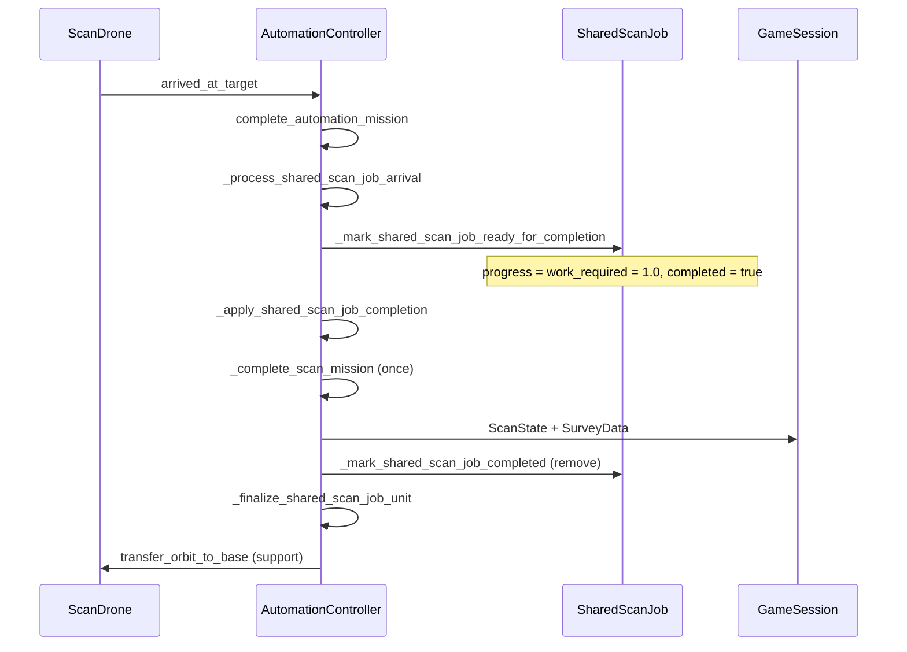

# SharedScanJob Step 4 — Single-Drone Processing v0.1

**Date:** 2026-06-07  
**Godot:** 4.6.1 / strictly typed GDScript  
**Scope:** SharedScanJob as completion/progress owner — **no Multi-SD, no gameplay balance change, SAVE_VERSION unchanged.**

---

## Audit Summary

| # | Question | Answer (pre-Step-4) |
|---|----------|---------------------|
| 1 | Immediate completion on arrival | `_on_scan_drone_arrived_at_target()` → `_try_complete_scan_mission_with_shared_job_guard()` called `_complete_scan_mission()` directly |
| 2 | Path to `_complete_scan_mission()` | Single call site via Step 3 guard wrapper |
| 3 | SurveyData / ScanState | `GameSession.grant_scan_survey_data_reward()` / `set_object_scan_state()` inside `_complete_scan_mission()` |
| 4 | Existing SharedScanJob flags | `completed`, `completion_applied`, `reward_given`, `progress`, `work_required` |
| 5 | Duplicate completion paths | Guard on `completion_applied`; arrival signal could theoretically re-fire — blocked by guard |
| 6 | Galaxy restore | `_restore_scan_mission()` → `_reconstruct_shared_scan_job_for_restored_mission()` |

---

## Step 4 Pipeline

**Rule:** Only `_apply_shared_scan_job_completion()` calls `_complete_scan_mission()`.

---

## New / Updated Methods

| Method | Role |
|--------|------|
| `_resolve_shared_scan_job_id_for_arrival` | Lookup or reconstruct job on arrival |
| `_mark_shared_scan_job_ready_for_completion` | Set `progress = work_required`, `completed = true` |
| `_apply_shared_scan_job_completion` | **Sole** `_complete_scan_mission()` caller; duplicate guard |
| `_process_shared_scan_job_arrival` | Arrival orchestration |
| `_finalize_shared_scan_job_unit` | Support orbit + mission cleanup |

Removed: `_try_complete_scan_mission_with_shared_job_guard`.

---

## Progress Model (Step 4)

- `SHARED_SCAN_JOB_WORK_REQUIRED = 1.0`
- In-flight: `progress = 0.0`
- On arrival: `progress = work_required = 1.0`, `completed = true`
- No tick-based scan progression; `unit.work_duration` unchanged (visual orbit only).

---

## Duplicate Guard

If `completion_applied == true` or job missing on re-apply:
- No reward, no ScanState, no second `transfer_orbit_to_base`
- `push_warning`, return `false`, no crash

Missing job on arrival: reconstruct from mission data, then process.

---

## Telemetry

`shared_scan_jobs` section extended:
- Top-level `completion_owner: "shared_scan_job"`
- Per job: `progress`, `work_required`, `completed`, `completion_applied`, `reward_given`, `completion_owner`

Step 2 fields unchanged.

---

## Tests

- `shared_scan_job_step_4_single_drone_processing_smoke_test.gd`
- Regression: Step 3, Step 2 telemetry, galaxy continuity

---

## Risks

1. **Instant ready-on-arrival** — Multi-SD later must share job progress tick, not per-unit arrival completion.
2. **Job removal after apply** — Telemetry shows active jobs only; completed state not archived.
3. **Reconstruct fallback** — Missing job on arrival logs warning; should not lose rewards if reconstruct succeeds.

---

## Status

**Step 4 done.**

- SharedScanJob is completion owner.
- Still no Multi-SD.
- `KEY_SCAN_ALREADY_IN_PROGRESS` unchanged.
- SAVE_VERSION unchanged.
