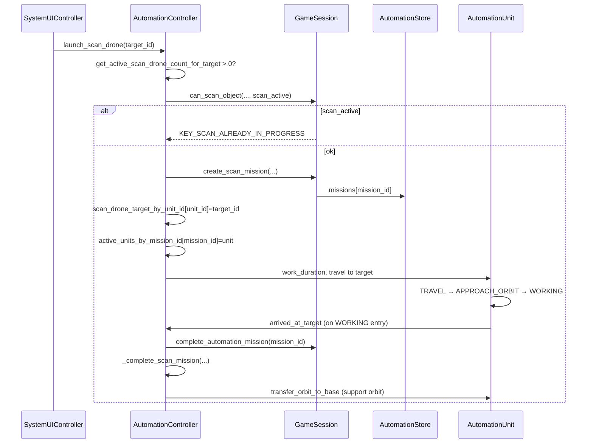

# Shared ScanJob Multi-ScanDrone Plan v0.1

**Date:** 2026-06-07  
**Godot:** 4.6.1 / strictly typed GDScript  
**Scope:** Design / audit / plan only — **no code, scene, data, or save-version changes in this document.**  
**Parent plan:** `docs/design/unlimited_production_multi_unit_target_plan_v0_1.md` (Step 5)  
**Audit reference:** `docs/audits/base_panel_unload_and_limits_audit_v0_1.md`

---

## Summary

### Ziel

Mehrere ScanDrones (SD) sollen am **selben Objekt** und **selben Scan-Layer** (Basic / Deep) parallel arbeiten können — analog zur bereits unterstützten Multi-MiningShip-Situation — ohne doppelte Rewards, doppelte ScanState-Updates, doppelte Mission-Completions, Save/Load-Brüche, hängende Drones oder irreführende UI.

### Warum `KEY_SCAN_ALREADY_IN_PROGRESS` aktuell korrekt ist

Der Gate-Key wird gesetzt, sobald `get_active_scan_drone_count_for_target(target_id) > 0`. Diese Zählung umfasst **alle** Einträge in `scan_drone_target_by_unit_id` für das Ziel — einschließlich Drones in Support-Orbit **nach** abgeschlossenem Scan. Solange mindestens eine SD dem Objekt zugeordnet ist, blockiert `GameSession.can_scan_object(..., target_has_active_scan=true)` jeden weiteren Scan-Start mit `KEY_SCAN_ALREADY_IN_PROGRESS`.

Das verhindert heute effektiv:

- eine zweite `AutomationStore`-Scan-Mission auf demselben `target_id`
- mehrere parallele Aufrufe von `_complete_scan_mission()` (jeder mit `set_object_scan_state` + `grant_scan_survey_data_reward`)
- mehrere `complete_automation_mission()`-Zyklen für dasselbe Scan-Ergebnis

Der Block ist damit **kein veraltetes Build-Limit**, sondern der einzige Schutz gegen Duplicate-Completion in einem Modell ohne Shared Progress.

### Warum der Block nicht einfach entfernt werden darf

`AutomationStore` erzwingt **keine Eindeutigkeit** von `target_id` pro Mission. `launch_scan_drone()` erstellt pro Start eine neue `mission_id`. Completion läuft in `_on_scan_drone_arrived_at_target()` → `_complete_scan_mission()` — **pro ankommender Drone einmal**, unabhängig von anderen Drones auf demselben Ziel.

Entfernt man nur den Gate ohne Shared-Job-Architektur:

| Effekt | Folge |
|--------|-------|
| N parallele Missionen | N × `complete_automation_mission` |
| N × `_complete_scan_mission` | N × `set_object_scan_state`, N × SurveyData-Reward, N × Resource-Init |
| Kein Shared Progress | `work_timer` / `work_duration` pro Unit — Completion feuert aber heute schon beim **Betreten** von `WORKING` (`arrived_at_target`), nicht am Ende von `work_timer` |
| Save | `scan_missions[]` mit mehreren Einträgen gleicher `target_id`, jeweils eigener `mission_id` / `scan_reveal_done` |

`KEY_SCAN_ALREADY_IN_PROGRESS` muss **behalten** bleiben, bis ein Shared-ScanJob-Modell Duplicate-Completion strukturell unmöglich macht. Danach wird der Key **umgedeutet** (Assign-to-existing-job statt harter Block), nicht gelöscht.

### Empfohlene Lösung

**Shared ScanJob** pro `(system_id, target_id, scan_layer)`:

- Ein gemeinsamer Fortschritt (`progress` / `work_required`) auf Job-Ebene
- Mehrere `assigned_unit_ids`; jede Drone maximal einem aktiven Job
- Completion, Reward und ScanState **genau einmal** (`completed` + `reward_given` Guards)
- `KEY_SCAN_ALREADY_IN_PROGRESS` → später: „Job läuft — idle Drone zuweisen“ statt „verboten“
- Diminishing Returns für Scan-Speed (Kandidat, Balance später per Telemetry)
- Save: **Option A** bevorzugt (v1-kompatibel, Rekonstruktion aus `scan_missions[]`)

Multi-MiningShip bleibt unverändert (bereits unterstützt, separates Problemfeld).

---

## Current State Audit

### ScanDrone-Missionen: Start bis Completion



**Wichtige Ist-Abweichung vom intuitiven „Scan-Dauer“-Modell:** `AutomationUnit.arrived_at_target` wird beim **Übergang in `WORKING`** emittiert (`_process_approach_orbit`), nicht wenn `work_timer >= work_duration`. `_complete_scan_mission()` läuft damit **sofort nach Orbit-Annäherung**, nicht nach Abarbeiten von `work_duration`. `work_duration` dient primär der visuellen Orbit-Phase; der Gameplay-Effekt (ScanState, Reward) passiert beim ersten `WORKING`-Frame.

### Wo `target_id` gespeichert wird

| Speicher | Typ | Semantik |
|----------|-----|----------|
| `AutomationController.scan_drone_target_by_unit_id` | `int → String` | unit instance id → `target_id`; bleibt nach Scan-Completion für Support-Orbit erhalten |
| `AutomationController.active_units_by_mission_id` | `int → AutomationUnit` | Nur während Outbound + bis `arrived_at_target` |
| `AutomationStore.missions[mission_id]` | Dictionary | `target_id`, `target_scan_state`, `scan_is_progression`, `base_id` |
| Save `scan_missions[].target_id` | String | Pro Drone ein Job-Eintrag |

Kein `target_id → job` Index. Keine Eindeutigkeit auf Store-Ebene.

### Wo aktive Scan-Jobs geprüft werden

| Prüfung | Ort | Logik |
|---------|-----|-------|
| Launch-Block | `automation_controller.launch_scan_drone()` L565–577 | `scan_active = get_active_scan_drone_count_for_target(target_id) > 0` |
| UI Gate | `system_ui_controller._apply_scan_drone_info_to_dict()` L668–675 | Gleiche `scan_active`-Semantik |
| Scan-Button-Handler | `system_ui_controller` ~L1017–1029 | `can_scan_object` vor `launch_scan_drone` |
| Gate-Implementierung | `game_session.can_scan_object()` L1711–1716 | `target_has_active_scan` → `KEY_SCAN_ALREADY_IN_PROGRESS` |

`get_active_scan_drone_count_for_target()` zählt **alle** zugeordneten Drones (Mission + Support), nicht nur „Scan in progress“.

`get_active_scan_job_count_for_session_base()` zählt `scan_drone_target_by_unit_id.size()` — **alle** SD-Zuweisungen der Session-Base, nicht pro Target.

Support-Drones (`get_active_scan_drone_support_count_for_target`) sind ein **separater** Pfad für Mining-Bonus (max. 1 zählend), beeinflussen den Scan-Gate aber indirekt, weil Support-Einträge in `scan_drone_target_by_unit_id` den Launch-Block triggern.

### Wo `KEY_SCAN_ALREADY_IN_PROGRESS` entsteht

`GameSession.can_scan_object()` wenn `target_has_active_scan == true` → `_scan_blocked(GateUiTextDefinition.KEY_SCAN_ALREADY_IN_PROGRESS, ...)`.

Aufrufer setzen `target_has_active_scan` aus `get_active_scan_drone_count_for_target(object_id) > 0` — **nicht** aus einem dedizierten „in-progress scan job“-Flag.

### ScanCompletion

| Schritt | Datei | Methode |
|---------|-------|---------|
| Signal | `automation_unit.gd` | `arrived_at_target.emit` bei `WORKING`-Eintritt |
| Handler | `automation_controller.gd` | `_on_scan_drone_arrived_at_target()` |
| Mission schließen | `game_session.gd` → `automation_store.gd` | `complete_automation_mission()` / `complete_mission()` — Mission aus Store entfernt |
| Gameplay-Completion | `automation_controller.gd` | `_complete_scan_mission()` |
| ScanState | `game_session.gd` → `object_scan_store.gd` | `set_object_scan_state(system_id, object_id, completion_state)` |
| SurveyData | `game_session.gd` | `grant_scan_survey_data_reward(base_id, completion_state)` |
| Resources | `automation_controller.gd` | `ensure_object_resources_initialized`, `ensure_mining_resources_for_object` |
| Drone danach | `automation_controller.gd` | `transfer_orbit_to_base(target_node)` → Support-Orbit, Eintrag in `scan_drone_target_by_unit_id` bleibt |

`scan_is_progression == false` (Rescan): SFX only, kein ScanState/Reward-Update.

### Save / Restore Scan-Missionen

| Aspekt | Detail |
|--------|--------|
| Save-Version | `SaveManager.SAVE_VERSION = 1` (unverändert laut Scope) |
| Pfad | `game_session.automation.runtime` via `AutomationSaveService.build_runtime_save_data()` |
| Format | `scan_missions: Array[Dictionary]` — **ein Eintrag pro Drone** |
| Felder pro Job | `target_id`, `base_id`, `mission_id`, `orbit_anchor_id`, `unit_state`, `work_timer`, `work_duration`, `travel_progress`, `scan_reveal_done`, Position/Orbit-Parameter |
| `scan_reveal_done` | `true` wenn Mission bereits abgeschlossen (Support-Orbit); `mission_id` dann oft 0 oder nicht in `active_units_by_mission_id` |
| `target_scan_state` | **Nicht** im Save-Job-Dict; nur in `AutomationStore.missions[mission_id]` während aktiver Mission |
| Restore | `AutomationController._restore_scan_mission()` — spawnt Unit, rekonstruiert Mission-Record falls nötig, verbindet `arrived_at_target`-Handler |

### Audit-Tabelle

| System | Datei | Methode / Symbol | Aktuelles Verhalten | Risiko bei Multi-SD (ohne Shared Job) |
|--------|-------|------------------|---------------------|--------------------------------------|
| Launch | `automation_controller.gd` | `launch_scan_drone()` | Eine Mission pro Klick; Gate via `scan_active` | Gate-Entfernung → N Missionen |
| Target-Map | `automation_controller.gd` | `scan_drone_target_by_unit_id` | Viele Units → gleiches `target_id` möglich (Gate verhindert) | Keine Job-Konsolidierung |
| Active-Mission-Map | `automation_controller.gd` | `active_units_by_mission_id` | 1:1 mission_id ↔ unit während Transit | N parallele Handler |
| Mission Store | `automation_store.gd` | `create_scan_mission()` | Keine `target_id`-Unique-Constraint | Duplicate Mission Records |
| Scan Gate | `game_session.gd` | `can_scan_object()` | `KEY_SCAN_ALREADY_IN_PROGRESS` bei `target_has_active_scan` | Einziger Duplicate-Schutz |
| Completion | `automation_controller.gd` | `_complete_scan_mission()` | Idempotent **nicht** — jedes Mal State + Reward | **Kritisch:** N-fache Rewards |
| Mission Complete | `game_session.gd` | `complete_automation_mission()` | Löscht Mission; kein Shared Owner | Race bei N Completions |
| Unit Timing | `automation_unit.gd` | `arrived_at_target` / `work_timer` | Completion bei WORKING-Start, nicht `work_timer`-Ende | Kein Shared Progress |
| Save Build | `automation_save_service.gd` | `build_scan_missions_array()` | Pro Drone ein Dict; kein Shared Progress Feld | Mehrere Jobs gleiches Target ohne Merge |
| Save Restore | `automation_controller.gd` | `_restore_scan_mission()` | Pro Array-Eintrag eine Drone + ggf. Mission | N Restore → N Completion-Pfade |
| UI Gate | `system_ui_controller.gd` | `_apply_scan_drone_info_to_dict()` | `scan_active` blockiert Button | Kein „Assign“-Pfad |
| UI Status | `object_info_panel.gd` | `_apply_automation_status()` | `drone_on_mission = total - supporting` | Kein Shared-Progress / ETA |
| Telemetry | `balance_telemetry_logger.gd` | `_snap_scan()` | `active_scan_jobs` = alle SD-Zuweisungen Base | Kein per-target / shared progress |
| Mining Bonus | `automation_controller.gd` | `get_active_scan_drone_support_count_for_target()` | Max 1 Support für Yield-Bonus | Multi-SD Support-Orbits nach Job-Ende |
| Parent Plan | `unlimited_production_multi_unit_target_plan_v0_1.md` | Step 5 | Shared progress vorgesehen | Ohne Step 5 → Duplicate-Risiko |

---

## Problem

### Was kaputtgeht, wenn nur der Gate entfernt wird

**1. Mehrere einzelne Missionen auf gleichem `target_id`**

Jeder `launch_scan_drone()`-Aufruf erzeugt `mission_id++` in `AutomationStore`. `active_units_by_mission_id` und `scan_drone_target_by_unit_id` wachsen unabhängig.

**2. Mehrere Completion-Events**

Jede Drone emittiert `arrived_at_target` beim eigenen `WORKING`-Eintritt → `_on_scan_drone_arrived_at_target` → `_complete_scan_mission()` pro Drone.

**3. Mehrfach `set_object_scan_state()`**

Jeder `_complete_scan_mission()`-Aufruf mit `scan_is_progression == true` setzt den ScanState erneut (idempotent auf State-Wert, aber mit Seiteneffekten in nachgelagerten Systemen).

**4. Mehrfach SurveyData / Reward**

`grant_scan_survey_data_reward()` addiert `balance.get_scan_survey_data_reward_for_state()` pro Completion — **direkte Wirtschafts-Explosion**.

**5. Unklare Drone-Zustände**

Mix aus Units in `TRAVEL`, `WORKING`, `ORBITING_BASE` auf demselben Target ohne Job-Owner. Recall-Logik (`can_recall_drone`) basiert auf `scan_drone_target_by_unit_id`, nicht auf Job-Lifecycle.

**6. Save/Load mit mehreren Scan-Missions auf gleichem Ziel**

`build_scan_missions_array()` serialisiert jeden Eintrag separat. Nach Load: mehrere Units mit ggf. `scan_reveal_done == false` und rekonstruierten Missionen → erneut mehrere Completion-Pfade möglich.

**7. UI zeigt falschen Fortschritt**

`object_info_panel` unterscheidet nur `drone_on_mission` vs. `drone_supporting`. Kein gemeinsamer Fortschrittsbalken, keine `effective_speed_multiplier`, ETA basiert nicht auf Shared Job.

**8. Zusätzliches Ist-Problem (auch mit Gate)**

Support-Drones nach abgeschlossenem Basic-Scan blockieren Deep-Scan-Start über `scan_active`, obwohl kein aktiver Scan mehr läuft — bis Recall. Shared-Job-Design muss **„Scan in progress“** von **„Drone am Objekt (Support)“** trennen.

---

## Target Design

### Kernregeln

1. Pro **Object + Scan-Layer** existiert höchstens **ein** Shared ScanJob (pro `system_id`).
2. Mehrere ScanDrones können demselben Job zugewiesen werden.
3. **Fortschritt gehört dem Job**, nicht der einzelnen Drone.
4. Job wird **genau einmal** abgeschlossen; Reward und ScanState **genau einmal**.
5. Nach Completion: alle `assigned_unit_ids` → Return to Base **oder** Support-Orbit (Produktentscheidung; Ist-Verhalten: Support-Orbit).
6. Neue idle Drones können einem **laufenden** Job beitreten (Assign).
7. Eine Drone darf nur **einem** aktiven ScanJob gleichzeitig angehören.

### Job-Key

```
shared_scan_job_key = system_id + ":" + target_id + ":" + scan_layer
```

`scan_layer` aus `target_scan_state` ableiten (z. B. Basic → `0`, Deep → `1`, Special → `2`) — Mapping an `GameSession` / `ObjectScanStore` Konstanten koppeln.

**Beispiele:**

- `solar-system:mars:0` → Basic-Scan Job auf Mars  
- `solar-system:mars:1` → Deep-Scan Job auf Mars (parallel zu Support von Basic möglich, sofern Layer-Regeln es erlauben)

### Verhalten vs. Ist-Modell

Target Design führt ein **echtes progress-basiertes Completion** ein (`progress >= work_required`), im Gegensatz zum heutigen Instant-Complete bei `WORKING`-Eintritt. Das ist **notwendig**, damit Multi-Drone-Speed-Stacking sinnvoll ist und Completion einmalig zentralisiert werden kann.

---

## Shared ScanJob Data Model

### Runtime (Vorschlag)

```gdscript
# AutomationController oder dedizierter SharedScanJobStore — nur Plan, kein Code
shared_scan_jobs: Dictionary  # job_id: String -> SharedScanJobDict
```

```gdscript
{
  "job_id": String,              # == shared_scan_job_key
  "system_id": StringName,
  "target_id": StringName,
  "base_id": StringName,
  "scan_layer": int,               # aus target_scan_state
  "target_scan_state": String,   # SCAN_BASIC / SCAN_DEEP / …
  "scan_is_progression": bool,
  "progress": float,
  "work_required": float,
  "assigned_unit_ids": Array[int],
  "completed": bool,
  "reward_given": bool,
}
```

### Invarianten

| Regel | Zweck |
|-------|-------|
| `assigned_unit_ids` kann mehrere ScanDrones enthalten | Multi-SD |
| `progress` nur auf Job-Ebene | Kein Split-Progress pro Drone |
| Max. 1 aktiver Job pro `unit_id` | Keine Doppelzuweisung |
| `completed` / `reward_given` Guards | Duplicate-Prevention |
| Job-Lifecycle getrennt von `scan_drone_target_by_unit_id` Support-Einträgen | Deep-Scan trotz Support-Drone (wenn Layer erlaubt) |

### Index-Strukturen (Implementierung)

- `job_id_by_unit_id: Dictionary` — schneller Lookup
- Optional `active_job_id_by_target_layer: Dictionary` — UI / Gate

`AutomationStore.missions` kann für **Outbound-Transit** pro Drone bestehen bleiben, bis Job „arrived“ ist; oder Mission wird zum Job-Handle — **Implementierungsdetail Step 4**.

---

## Scan Speed / Stacking

### Kandidat: Diminishing Returns

```
effective_speed = base_speed * (1.0 + max(0, drone_count - 1) * 0.65)
```

| Drones | Multiplikator (Kandidat) |
|--------|------------------------|
| 1 | 100 % |
| 2 | 165 % |
| 3 | 230 % |
| 4 | 295 % |

`base_speed` aus bestehendem `GameSession.get_scan_duration_seconds_for_target_state()` / Upgrade-Multiplier ableiten — invertiert in `progress += effective_speed * delta`.

### Hinweise

- **Keine finalen Balance-Werte** in diesem Plan.
- Travel-Zeit pro Drone bleibt individuell (kein Teleport zum Job).
- Job-Progress tickt nur, wenn mindestens eine Drone im **arbeitenden** Zustand am Job ist (Definition: `WORKING` am Target, nicht `TRAVEL`).
- `BalanceTelemetryLogger` (Step 8) validiert `time_to_basic_scan_with_1/2/3 drones`.

---

## Launch Flow

Geplanter Ablauf (spätere Implementierung):

1. Spieler wählt Scan auf Object (Basic / Deep gemäß `get_scan_target_state_or_rescan_state`).
2. **Kein SharedScanJob** für `(system_id, target_id, scan_layer)`:
   - Job erstellen (`progress = 0`, `work_required` aus Balance)
   - idle ScanDrone zuweisen
   - Outbound starten (wie heute, aber Job-gebunden)
3. **SharedScanJob existiert** und `completed == false`:
   - UI später: **„Assign ScanDrone“** (kein neuer Job)
   - idle Drone zu `assigned_unit_ids` hinzufügen, Outbound starten
4. **Keine idle ScanDrone:** Block mit `KEY_SCAN_NO_DRONE` (bestehend).
5. **Scan-Layer bereits abgeschlossen** (Progression): Block mit bestehenden Layer-Gates / Rescan-Regeln.
6. **Job `completed`:** neuer Layer-Scan nur wenn `get_scan_target_state_or_rescan_state` es erlaubt.

### `KEY_SCAN_ALREADY_IN_PROGRESS` — spätere Umdeutung

| Heute | Ziel |
|-------|------|
| `target_has_active_scan` → hard block | `target_has_active_scan_job_for_layer` + idle drone? → **Assign** statt block |
| Kein idle drone + Job läuft | Weiterhin blockiert (evtl. gleicher Key oder separater „No idle scan drone“-Text) |
| Support-Drone ohne aktiven Job | **Darf** neuen Layer-Scan nicht blockieren |

Key **nicht entfernen** — Semantik und Aufrufparameter ändern.

---

## Completion Flow

1. `_process` / Job-Tick: `progress += effective_speed * delta` für aktive Job-Teilnehmer.
2. Wenn `progress >= work_required` und `not completed`:
   - `completed = true` setzen (atomar / einmalig)
   - Wenn `scan_is_progression` und `not reward_given`:
     - `set_object_scan_state()` einmal
     - `grant_scan_survey_data_reward()` einmal
     - Resource-Init einmal
     - `reward_given = true`
   - `complete_automation_mission()` für alle noch offenen Transit-Missionen der Units **oder** Mission-Modell vereinfachen
3. Alle `assigned_unit_ids`:
   - Support-Orbit (Ist-Verhalten) oder Return — konsistent für alle
4. Job aus `shared_scan_jobs` entfernen oder als abgeschlossen archivieren (nicht für Assign nutzbar)
5. `automation_state_changed` → UI + Telemetry

### Akzeptanz-Guards

- `reward_given` verhindert doppelte SurveyData auch bei Save-Restore-Races.
- `completed` verhindert doppelte ScanState-Updates und erneutes Job-Ticking.

---

## Save/Load Impact

### Ist-Format (Save v1)

```json
"automation": {
  "runtime": {
    "system_id": "...",
    "primary_base_id": "...",
    "scan_missions": [ { "target_id", "mission_id", "scan_reveal_done", "work_timer", ... } ],
    "mining_missions": [ ... ]
  }
}
```

`AutomationStore.to_save_data()` separat für offene `missions` mit `target_scan_state`.

### Option A — v1-kompatibel, Rekonstruktion (empfohlen)

**Idee:** `scan_missions[]` bleibt pro Drone. Beim Save/Load wird ein Shared Job **abgeleitet**:

- Gruppierung: `(system_id, target_id, target_scan_state)` aus Mission-Record oder abgeleitetem Layer
- `progress` = aggregierter Wert (z. B. Maximum der gespeicherten `work_timer / work_duration` über Units im selben Job, oder neues optionales Feld `shared_progress` pro Eintrag ohne Version-Bump wenn nur additive Keys)
- `assigned_unit_ids` = alle Unit-IDs der Gruppe mit `scan_reveal_done == false`
- `completed` / `reward_given` aus `scan_reveal_done` und globalem ScanState am Object

| Kriterium | Bewertung |
|-----------|-----------|
| Aufwand | Mittel — Merge-Logik in Restore + konsistentes Save-Schreiben |
| Risiko | Mittel — Rekonstruktionsfehler bei gemischten Transit-Zuständen |
| Restore-Stabilität | Gut wenn Merge-Tests für 1/2/3 Drones mid-scan |
| Debugbarkeit | Mittel — Job muss aus Array recomputed werden |

### Option B — neues `shared_scan_jobs` Feld

**Idee:** `runtime.shared_scan_jobs: Dictionary` zusätzlich zu `scan_missions[]`.

| Kriterium | Bewertung |
|-----------|-----------|
| Aufwand | Höher — neues Schema, Dual-Write, Migration |
| Risiko | Hoch ohne Save-Version — alte Saves kennen Feld nicht |
| Restore-Stabilität | Gut wenn Feld autoritativ ist |
| Debugbarkeit | Hoch — expliziter Job-State |

**Save-Version:** User-Scope verbietet Version-Bump in diesem Plan. Option B erfordert entweder additive v1-Felder (unkritisch für Loader) oder späteren `SAVE_VERSION = 2` Migration-Plan.

### Empfehlung

**Option A zuerst:** Kein `SAVE_VERSION`-Bump, additive Felder in `scan_missions[]` optional (`job_id`, `shared_progress`) wenn Rekonstruktion allein zu fragil ist. Shared-Job-Dict zur Laufzeit autoritativ; Save bleibt drone-zentriert.

**QA-Pflicht:** Save mid-scan mit 2 Drones gleiches Target → Load → ein Job, ein Progress, kein doppeltes Reward.

---

## UI Plan

**Nur Plan — keine Implementierung, keine `.tscn`-Änderung, `tooltip_text` bleibt 0.**

### ObjectInfoPanel — Scan-Button-Zustände

| Zustand | Button-Label (Konzept) | Enabled |
|---------|-------------------------|---------|
| Kein Job, Layer scannbar | „Start Basic Scan“ / „Start Deep Scan“ | ja, wenn idle SD |
| Job läuft, idle SD vorhanden | „Assign ScanDrone“ | ja |
| Job läuft, keine idle SD | „No idle ScanDrone“ | nein |
| Layer fertig / Gate | bestehende blocked_reason | nein |

### Zusätzliche Anzeige (Konzept)

- `assigned_scan_drones` (Count oder Liste)
- `scan_progress_percent` (Job `progress / work_required`)
- `estimated_time_remaining` (aus `effective_speed`)
- `effective_speed_multiplier`

Daten via `SystemUIController` → `info` Dictionary (analog `active_scan_drone_count` heute).

### Kein Tooltip

Keine neuen `tooltip_text`-Properties. Blockgründe weiter über `scan_blocked_reason` / Button disabled.

---

## Telemetry Plan

Erweiterung `balance_telemetry_logger.gd` (später):

| Feld | Zweck |
|------|-------|
| `active_shared_scan_jobs` | Anzahl laufender Jobs |
| `assigned_scan_drones_per_target` | `Dict[target_id → count]` |
| `scan_speed_multiplier` | Effektiver Multiplikator pro Job |
| `shared_scan_progress` | `Dict[job_id → percent]` |
| `scan_completion_once` | Milestone bei erstem Shared-Complete |
| `duplicate_reward_prevention_count` | Guard-Aktivierungen (sollte 0 in Normalfall) |
| `time_to_basic_scan_with_1/2/3_drones` | Balance-Kurven |
| `time_to_deep_scan_with_1/2/3_drones` | Balance-Kurven |

Step 2 (Telemetry vorbereiten): zuerst **Ist-Zustand** loggen — `get_active_scan_drone_count_for_target` per ausgewähltem Target, Anzahl Targets mit `count > 1` (sollte 0 sein bis Feature aktiv).

---

## Migration / Backward Compatibility

| Szenario | Erwartetes Verhalten |
|----------|----------------------|
| Alte Save: 1 ScanMission, mid-transit | Restore → 1 Shared Job, 1 Drone, Progress aus `work_timer/work_duration` |
| Alte Save: 1 SD Support-Orbit (`scan_reveal_done=true`) | Kein aktiver Job; `scan_drone_target_by_unit_id` bleibt; blockiert Layer-Scan nicht mehr nach Gate-Fix |
| Neue Save: 2+ Drones selbes Target mid-scan | Merge zu 1 Job; `reward_given=false` bis Completion |
| Restore: `completed=true`, `reward_given=false` | Einmalig Reward nachziehen, dann `reward_given=true` (Recovery) |
| Restore: `completed=true`, `reward_given=true` | Kein erneuter Reward |
| Kaputte Daten (2 Jobs gleicher Key) | Merge mit Warning-Log; höherer Progress gewinnt; Completion einmalig |

---

## Step-by-Step Implementation Plan

| Step | Beschreibung | Dateien (primär) | Validation |
|------|--------------|------------------|------------|
| **1** | Read-only Audit + dieser Plan | `docs/design/shared_scan_job_multi_scan_drone_plan_v0_1.md` | Review sign-off |
| **2** | Telemetry vorbereiten: active scan per target / duplicate-target count | `balance_telemetry_logger.gd` | JSON zeigt per-target counts |
| **3** | SharedScanJob Runtime-Modell einführen, UI noch gesperrt | `automation_controller.gd` | Unit-Tests / Debug: Job create/lookup |
| **4** | Eine SD nutzt intern SharedScanJob statt Instant-Complete | `automation_controller.gd`, `automation_unit.gd` (Tick-Hook) | 1 SD: gleiches Timing ±ε |
| **5** | Save/Load stabilisieren (Option A) | `automation_save_service.gd`, `automation_controller.gd` | mid-scan 2 SD save/load |
| **6** | UI „Assign ScanDrone“ + Gate-Umdeutung | `system_ui_controller.gd`, `object_info_panel.gd` | Button-Zustände ohne Tooltip |
| **7** | Diminishing Returns aktivieren | `automation_controller.gd` / `game_session.gd` | 2–3 SD Speed-Kandidat |
| **8** | 10-Minuten Scan-Balance-Test | Telemetry + Audit-Notiz | Kurven vs. ColonyShip-Plan |

**Step 1 = dieser Dokument.** Kein Code in Step 1.

---

## Risks

| Risiko | Severity | Warum | Mitigation |
|--------|----------|-------|------------|
| Duplicate rewards | **Critical** | N × `grant_scan_survey_data_reward` ohne Guards | Shared Job + `reward_given`; ein Completion-Owner |
| Duplicate scan state | **High** | N × `set_object_scan_state` | `completed` Guard; ein Completion-Pfad |
| Stuck drones after completion | **High** | Units nicht aus Job released | Completion-Handler iteriert `assigned_unit_ids`; Fallback-Recall |
| Save/load broken mid-scan | **High** | Merge/Rekonstruktion falsch | Option A QA; Smoke-Test 2 SD; Recovery-Flags |
| Old saves incompatible | **Medium** | Neues Felder / Semantik | Option A; lazy defaults; keine Version-Bump-Pflicht |
| UI shows wrong ETA | **Medium** | Shared speed + Travel-Mix | ETA nur aus Job-Progress + `effective_speed`; UI-Plan Step 6 |
| Scan becomes too fast | **High** | Multi-Drone ohne DR | Diminishing Returns; Telemetry Step 8 |
| Deep scan becomes trivial | **High** | 3+ SD auf Deep | Separate `work_required` für Deep; DR; Balance-Run |
| Object info refresh desync | **Medium** | `automation_state_changed` nicht überall | Completion + Assign → `_request_automation_state_changed` |
| Performance with many scan drones | **Low–Medium** | Viele Units / Jobs | Job-Tick O(jobs); nicht O(units²) |
| Support vs. active job confusion | **Medium** | `scan_drone_target_by_unit_id` Überladung | Getrennte Queries: `has_active_shared_scan_job(layer)` vs. `support_count` |
| Instant-complete refactor | **Medium** | Verhalten ändert sich auch für 1 SD | Step 4 explizit: 1-Drone-Parity testen |

---

## Recommendation

1. **`KEY_SCAN_ALREADY_IN_PROGRESS` jetzt behalten** — kein blindes Entfernen in Step 2a/2b oder als Hotfix.
2. **SharedScanJob zuerst intern** (Steps 3–5) vor UI-Freischaltung (Step 6).
3. **Multi-SD erst nach Save / Completion / Reward-Schutz** aktivieren.
4. **Multi-MS separat lassen** — bereits unterstützt; kein Shared-Extraction-Job nötig.
5. **Gate-Semantik splitten:** „Drone am Object“ ≠ „Scan-Job läuft für Layer X“ — löst Support-vs-Deep-Block mit.
6. **Save v1 bevorzugen (Option A)** — Version-Bump erst wenn Option B oder Migration unvermeidbar.

### Akzeptanz (dieses Dokument)

1. Nur `docs/design/shared_scan_job_multi_scan_drone_plan_v0_1.md` erstellt.  
2. Keine Codeänderungen.  
3. Keine `.tscn` / `.tres` Änderungen.  
4. Keine Save-Version-Änderung.  
5. Keine Gameplay-Gates geändert.  
6. `KEY_SCAN_ALREADY_IN_PROGRESS` nicht entfernt — Umbau geplant, nicht Löschung.  
7. Plan erklärt Datenmodell, Save/Load-Risiken, UI-Plan, Implementation Steps.  
8. `tooltip_text` bleibt 0.

---

## Affected Files (reference index)

| Category | Paths |
|----------|-------|
| Controllers | `scripts/system/controller/automation_controller.gd`, `system_ui_controller.gd` |
| Stores | `scripts/autoload/stores/automation_store.gd`, `object_scan_store.gd` |
| Session | `scripts/autoload/game_session.gd` |
| Save | `scripts/system/automation/automation_save_service.gd`, `scripts/autoload/save_manager.gd` |
| Units | `scripts/automation/automation_unit.gd` |
| UI | `scripts/ui/system/object_info_panel.gd` |
| Telemetry | `scripts/debug/balance_telemetry_logger.gd` |
| Parent / Audit | `docs/design/unlimited_production_multi_unit_target_plan_v0_1.md`, `docs/audits/base_panel_unload_and_limits_audit_v0_1.md` |
