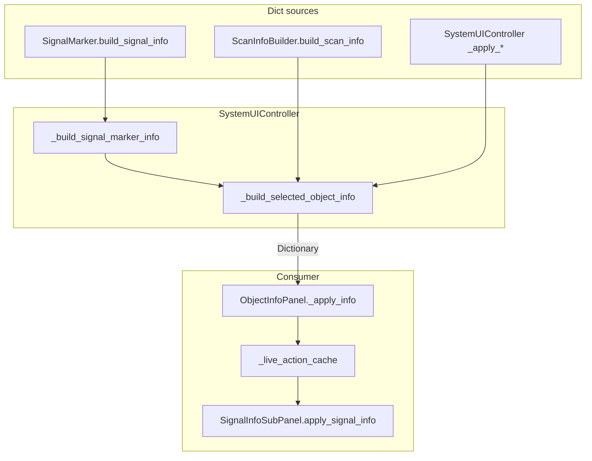

# SystemUIController Info-Dict Typing and Slimming Plan v0.1

**Date:** 2026-06-07  
**Scope:** Analysis + refactor plan only — **no code, scene, or resource changes.**  
**Trigger:** `docs/audits/full_project_cleanup_audit_v0_2.md` — J1 *Dictionary info dicts*, ~1244-line `system_ui_controller.gd`.  
**Verdict:** **PASS WITH NOTES**

---

## 1. Executive summary

`SystemUIController` is the central **info-Dictionary bridge** between world nodes (`SystemBody`, `PointOfInterest`, `SignalMarker`), gameplay gates (`GameSession`, `AutomationController`, survey/sensor controllers), and `ObjectInfoPanel.show_body_info()` / `show_poi_info()`.

Typing improved (0× `has_method` on nodes; typed panel refs), but the contract remains an **untyped `Dictionary`** with ~55 string keys assembled across four builder paths. `ProductionPanel` and `TopHUD` **do not** consume this dict — they use separate gate/API paths.

**Recommendation:** Do **not** jump to a full ViewModel (Option B). Start with **Option A** (key constants), then **Option C partial** — extract **`SignalObjectInfoBuilder`** first (smallest, isolated after SignalInfoSubPanel C1). Defer full `ObjectInfoViewModel` until Steps 1–4 are stable.

---

## 2. Current architecture



**Public panel API (unchanged today):**

- `ObjectInfoPanel.show_body_info(info: Dictionary)`
- `ObjectInfoPanel.show_poi_info(info: Dictionary)` — same `_apply_info` path
- `ObjectInfoPanel.apply_investigate_progress(progress: float)` — mutates panel cache, not dict
- `ObjectInfoPanel.set_distance_text(value_text: String)` — overwrites distance label; controller sets `distance_text` every `_process` frame

**File sizes (audit snapshot):** `system_ui_controller.gd` ~1611 lines; `object_info_panel.gd` ~1123 lines.

---

## 3. Dictionary build paths

| Path | Entry | Produces |
|------|-------|----------|
| **SIGNAL** | `_build_signal_marker_info` | `SignalMarker.build_signal_info()` + investigate gate fields |
| **KNOWN world** | `_build_selected_object_info` → `_build_world_object_info` | `ScanInfoBuilder` via body/POI + controller overlays |
| **Overlays (KNOWN)** | `_apply_scan_drone_info_to_dict`, `_apply_mining_ship_info_to_dict`, `_apply_sensor_pulse_info_to_dict`, `_apply_colonization_info_to_dict` | Gate/action/automation fields |
| **Runtime** | `_process` | `distance_text` on live panel only (not full dict rebuild) |

`update_object_info()` flow:

```text
selected_node → _build_selected_object_info → show_body_info / show_poi_info
```

---

## 4. Complete key inventory

Legend: **R** = required for panel to behave correctly; **O** = optional / defaulted; **S** = SIGNAL-only; **K** = KNOWN-only; **B** = home-base (`is_home_base`) only; **W** = written by world/scan builder; **C** = controller overlay; **—** = written but not read by panel (dead/reserved).

### 4.1 Identity & presentation (all contexts)

| Key | Type | Source | Panel use | Scope | Req |
|-----|------|--------|-----------|-------|-----|
| `id` | String | W/C | `current_object_id` | All | R |
| `object_id` | String | W (signal) | — | S | — |
| `display_name` | String | W/C | name label | All | R |
| `body_type` | String | W | type label (bodies) | K bodies | O |
| `poi_type` | String | W | type label (POIs) | K POI | O |
| `scan_state` | String | W/C | scan status label | All | R |
| `preview_texture` | Texture2D \| null | C | preview | All | O |
| `distance_text` | String | C + `_process` | distance label | All | O |
| `lore_text` | String | W/C | lore / signal sub-panel | All | O |

### 4.2 Scan / deposit resources (KNOWN)

| Key | Type | Source | Panel use | Scope | Req |
|-----|------|--------|-----------|-------|-----|
| `resources_visible` | Array[Dictionary] | W | resource rows | K | O |
| `resources_hidden_count` | int | W | — | K | — |
| `is_scanned` | bool | W | — | K | — |

**`resources_visible` entry shape (Variant-riskant):**

| Entry key | Type | Notes |
|-----------|------|-------|
| `id` | StringName | preferred store id |
| `resource_id` | String | legacy |
| `name` | String | legacy |
| `richness_percent` | int | scan metadata |
| `total` / `total_amount` / … | int | optional caps (`_read_total_amount_from_resource_entry`) |
| `display_text` | String | legacy pre-formatted; panel prefers live store amounts |

### 4.3 Scan drone / shared job (KNOWN, not signal/home-base)

| Key | Type | Source | Panel use | Scope | Req |
|-----|------|--------|-----------|-------|-----|
| `show_scan_with_drone` | bool | C | scan button visible | K | R |
| `can_scan_with_drone` | bool | C | scan button enabled | K | R |
| `scan_blocked_reason` | String | C | economy block label | K | O |
| `scan_button_text` | String | C | scan button label | K | O |
| `assigned_scan_drone_count` | int | C | orbit status label | K | O |
| `show_scan_drone_status` | bool | C | count label visible | K | O |
| `has_active_shared_scan_job` | bool | C | cached (assign path) | K | O |
| `active_scan_drone_count` | int | C | orbit drone line calc | K | O |
| `scan_drone_supporting_count` | int | C | orbit + bonus calc | K | O |

### 4.4 Mining ship (KNOWN, not signal/home-base)

| Key | Type | Source | Panel use | Scope | Req |
|-----|------|--------|-----------|-------|-----|
| `show_mine_with_ship` | bool | C | mine button visible | K | R |
| `can_mine_with_ship` | bool | C | mine button enabled | K | R |
| `mine_blocked_reason` | String | C | economy block label | K | O |
| `mining_button_text` | String | C | mine button label | K | O |
| `mining_exhausted` | bool | C/W | depleted button text | K | O |
| `assigned_mining_ship_count` | int | C | ship count label | K | O |
| `show_mining_ship_status` | bool | C | count label visible | K | O |
| `mining_ship_mining_count` | int | C | mine orbit label | K | O |
| `mining_bonus` | float | C | **not used for display** — panel recalculates % | K | — |
| `mining_yield_upgrade_base_id` | String | C | bonus % lookup in panel | K | O |
| `active_mining_ship_count` | int | C | — | K | — |

### 4.5 Recall (KNOWN)

| Key | Type | Source | Panel use | Scope | Req |
|-----|------|--------|-----------|-------|-----|
| `can_recall_drone` | bool | C | recall drone button | K | O |
| `can_recall_mining_ship` | bool | C | recall ship button | K | O |

### 4.6 Home base (B)

| Key | Type | Source | Panel use | Scope | Req |
|-----|------|--------|-----------|-------|-----|
| `is_home_base` | bool | C | suppresses orbit/mine/recall; enables sensor pulse | B | R |
| `show_sensor_pulse` | bool | C | sensor pulse button visible | B | O |
| `can_sensor_pulse` | bool | C | sensor pulse enabled | B | O |
| `sensor_pulse_blocked_reason` | String | C | economy block | B | O |
| `sensor_pulse_in_progress` | bool | C | progress label | B | O |
| `sensor_pulse_progress_text` | String | C | progress label text | B | O |
| `sensor_pulse_cost_text` | String | C | economy block (cost) | B | O |

When `is_home_base`, controller **zeros** automation orbit fields (drones/ships/bonus).

### 4.7 SIGNAL / discovery

| Key | Type | Source | Panel use | Scope | Req |
|-----|------|--------|-----------|-------|-----|
| `is_discovery_signal` | bool | W | toggles KNOWN vs signal sub-panel | S | R |
| `is_signal_marker` | bool | W | — | S | — |
| `signal_type` / `signal_type_id` / `signal_type_display_name` / `signal_type_short_label` / `signal_description` | various | W | — (not read by panel) | S | — |
| `can_investigate_signal` | bool | C | investigate button | S | R |
| `investigate_blocked_reason` | String | C | signal economy block | S | O |
| `investigate_in_progress` | bool | C | progress UI | S | O |
| `is_investigate_active` | bool | C | progress visibility | S | O |
| `investigate_progress` | float | C | progress bar/text | S | O |
| `investigate_progress_text` | String | C | progress label | S | O |
| `discovery_complete_message` | String | — | signal economy block | S | — (never set by controller today) |

Signal marker pre-sets scan/mine/recall to `false` / zero.

### 4.8 Colonization & session gate (mostly stub)

| Key | Type | Source | Panel use | Scope | Req |
|-----|------|--------|-----------|-------|-----|
| `colonization_button_visible` | bool | C | colonization button | K | O |
| `colonization_pending` | bool | C | button text state | K | O |
| `colonization_can_start` | bool | C | button enabled | K | O |
| `system_id` | String | C | — | K | — |
| `system_economy_blocked_reason` | String | C | blocks all actions | K | O (always `""` today) |

### 4.9 Economy-not-established branch

When no established base in system, controller clears scan/mine/recall/automation fields (`_build_selected_object_info` ~615–635). Panel still shows world scan info + lore.

---

## 5. Variant-risk hotspots

| Area | Risk | Mitigation in plan |
|------|------|-------------------|
| `resources_visible` entries | Mixed legacy/new shapes | Typed `ScanResourceRow` dict helper or `Array[Dictionary]` builder in `ScanInfoBuilder` |
| `preview_texture` | `Variant` until cast | ViewModel field `Texture2D` optional |
| `info.get("is_discovery_signal") == true` | Loose bool compare | Key constant + `bool` normalizer |
| `mining_bonus` vs panel recalc | Logic drift | Step 4: panel reads controller value only |
| `discovery_complete_message` | Dead key | Document; wire in signal builder or remove from cache |
| Gate dicts (`can_scan_object`, etc.) | Separate from info dict | Keep gate Dictionaries; map to typed info fields at builder boundary |

---

## 6. `has_method` / `call` audit

| Location | Status |
|----------|--------|
| `system_ui_controller.gd` | **0× `has_method` / `call(`** on arbitrary nodes (v0.2 DONE) |
| `system_ui_controller.gd` | **`has_signal` guards** remain for optional scene wiring (~15×) — acceptable |
| `scan_info_builder.gd` | `definition.has_method` + `definition.call` for resource layer getters — **separate** from UI bridge |
| `object_info_panel.gd` | `get_nodes_in_group("system_ui_controller")` fallback for investigate — not dict-related |

`production_panel.gd` uses `Dictionary` for **build gates** (`GameSession.get_build_base_*_gate`), not ObjectInfo dicts.  
`top_hud.gd` reads `GameSession` directly; hover content built in `SystemUIController._build_hover_details` (separate from ObjectInfo dict).

---

## 7. Extractable builder modules (Option C map)

| Builder | Moves from | ~Lines | Isolation |
|---------|------------|--------|-----------|
| **SignalObjectInfoBuilder** | `_build_signal_marker_info` | ~45 | **High** — single consumer, fixed key set |
| **KnownScanInfoEnricher** | `_build_selected_object_info` core + lore | ~100 | Medium — depends on selection + `ScanInfoBuilder` |
| **ScanDroneInfoOverlay** | `_apply_scan_drone_info_to_dict` | ~55 | Medium — needs automation + session gates |
| **MiningShipInfoOverlay** | `_apply_mining_ship_info_to_dict` | ~50 | Medium |
| **SensorPulseInfoOverlay** | `_apply_sensor_pulse_info_to_dict` | ~30 | **High** — home-base only |
| **ColonizationInfoOverlay** | `_apply_colonization_info_to_dict` | ~10 | High (stub) |

`SystemUIController` would orchestrate: `KnownScanInfoEnricher.build(node) + overlays.apply(info)`.

---

## 8. Option comparison

### Option A — Typed key constants

```gdscript
class_name ObjectInfoDictKeys
const ID: StringName = &"id"
const IS_DISCOVERY_SIGNAL: StringName = &"is_discovery_signal"
# ...
```

| Pros | Cons |
|------|------|
| Lowest risk; no API break | Still untyped values |
| Enables grep/refactor safety | No compile-time value checks |
| Good doc-as-code | |

### Option B — `ObjectInfoViewModel` Resource/RefCounted

| Pros | Cons |
|------|------|
| Typed fields | Breaks `show_body_info(Dictionary)` or needs adapter |
| | Touches all smokes + smoke synthetic dicts |
| | Medium–high regression risk |

### Option C — Small builders (recommended after A)

| Pros | Cons |
|------|------|
| Testable units | Medium churn in controller |
| Slimmer god file | Must keep dict contract during migration |

**v0.1 recommendation:** **A → C (signal first) → C (known overlays)**. Defer **B** until Step 5 evaluation.

---

## 9. Refactor steps (maximal klein)

### Step 1 — Key constants + contract doc (Option A)

| Item | Detail |
|------|--------|
| **Files** | New `scripts/ui/object_info/object_info_dict_keys.gd`; optional `docs/ui/object_info_dict_contract_v0_1.md` |
| **Change** | Add `class_name ObjectInfoDictKeys` with all keys from §4; no consumer migration required yet |
| **Risk** | **Very low** — additive only |
| **Smokes** | None required (no behavior change); optional static test that keys match panel `_live_action_cache` |
| **Rollback** | Delete new file |

### Step 2 — Extract `SignalObjectInfoBuilder` (Option C partial)

| Item | Detail |
|------|--------|
| **Files** | New `scripts/ui/object_info/signal_object_info_builder.gd`; slim `_build_signal_marker_info` to delegate |
| **Change** | Move `SignalMarker.build_signal_info()` merge + investigate gate + progress text |
| **Risk** | **Low** — isolated path; SignalInfoSubPanel C1 already bounds SIGNAL UI |
| **Smokes** | `object_info_signal_layout_smoke_runner`, `sensor_pulse_progress_label_cleanup_smoke_runner`, `galaxy_transition_repeated_survey_probe_smoke_runner` |
| **Rollback** | Inline builder back into controller |

### Step 3 — Extract `KnownObjectInfoBuilder` + overlays

| Item | Detail |
|------|--------|
| **Files** | `known_object_info_builder.gd`, optional `scan_drone_info_overlay.gd`, `mining_ship_info_overlay.gd`, `sensor_pulse_info_overlay.gd` |
| **Change** | Move `_build_selected_object_info` body (not signal branch) + `_apply_*` functions |
| **Risk** | **Medium** — many keys; home-base zeroing; economy-not-established branch |
| **Smokes** | Full §10 regression set |
| **Rollback** | Revert single PR; keep Step 2 |

### Step 4 — ObjectInfoPanel apply typing

| Item | Detail |
|------|--------|
| **Files** | `object_info_panel.gd` — optional `apply_object_info(info: Dictionary)` internal normalizer; use `ObjectInfoDictKeys`; fix `mining_bonus` display drift |
| **Change** | Typed read helper `_read_bool(info, key)`; use `info.mining_bonus` for label; keep public `show_body_info(Dictionary)` |
| **Risk** | **Medium** — panel is large |
| **Smokes** | Full §10 + `object_info_signal_layout` |
| **Rollback** | Revert panel-only PR |

### Step 5 — ViewModel evaluation (Option B)

| Item | Detail |
|------|--------|
| **Prerequisite** | Steps 1–4 stable; builders return dict or view-model |
| **Decision gate** | Only if dict key churn continues; else stay on typed dict + builders |
| **Risk** | **High** |

---

## 10. Mandatory smoke matrix (per implementation step)

| Smoke runner | Guards |
|--------------|--------|
| `object_info_simple_action_button_labels_smoke_runner.tscn` | Scan/Mine labels |
| `object_info_multi_ms_ui_smoke_runner.tscn` | Multi mining ship UI |
| `object_info_scan_drone_assign_ui_smoke_runner.tscn` | Shared scan assign |
| `sensor_pulse_progress_label_cleanup_smoke_runner.tscn` | Pulse vs investigate labels |
| `object_info_recall_button_language_pass_smoke_runner.tscn` | Recall EN |
| `galaxy_transition_repeated_survey_probe_smoke_runner.tscn` | Survey probe / signal flow |
| `shared_scan_job_step_6_ui_assign_scan_drone_smoke_runner.tscn` | Scan drone assign Step 6 |
| `object_info_signal_layout_smoke_runner.tscn` | SIGNAL compact layout (after Step 2+) |
| `top_hud_hover_storage_smoke_runner.tscn` | Unrelated to dict; run if controller touched broadly |

**Cross-cutting (every step with code change):**

- `SaveManager.SAVE_VERSION == 1`
- Project `tooltip_text` count == 0

---

## 11. Risks

| Risk | Severity | Notes |
|------|----------|-------|
| Key rename without constant | Medium | Step 1 prevents |
| Split builder breaks home-base zeroing | Medium | Step 3 smokes + manual home-base check |
| ViewModel too early | High | Defer to Step 5 |
| Smoke synthetic dicts drift from production | Medium | Document contract in Step 1; optional builder used in smokes |
| `discovery_complete_message` never wired | Low | Reserved; document or implement in Step 2 |
| `system_economy_blocked_reason` always empty | Low | Panel supports it; controller never sets non-empty |

---

## 12. Akzeptanz (this planning task)

| Kriterium | Status |
|-----------|--------|
| Kein Code geändert | ✓ |
| Aktuelle Dict-Keys dokumentiert | ✓ (§4) |
| Refactor-Stufen klein genug | ✓ (Steps 1–5) |
| Smokes pro Stufe definiert | ✓ (§9–10) |
| PASS / PASS WITH NOTES / FAIL | **PASS WITH NOTES** |

**Notes:**

1. `ProductionPanel` / `TopHUD` are **out of scope** for ObjectInfo dict typing (separate data paths).
2. `mining_bonus` and `discovery_complete_message` are **contract gaps** between controller and panel.
3. Audit v0.2 line count (~1244) is stale; file is ~1611 lines today (includes TopHUD hover B1).

---

## 13. Empfohlener erster Implementierungs-Step

**Step 1 + Step 2 in one PR (optional split):**

1. Add `ObjectInfoDictKeys` (constants only).
2. Extract `SignalObjectInfoBuilder.build(marker, survey_ctrl, base_id) -> Dictionary`.
3. Replace `_build_signal_marker_info` body with one delegate call.
4. Run: signal layout smoke, sensor pulse cleanup, galaxy repeated survey probe.

This is the **smallest behavior-preserving win**: ~45 lines leave the controller, SIGNAL path is bounded, and smokes are already strong.

**Do not start with** full ViewModel or full `_build_selected_object_info` extraction (Step 3) in the same PR.
