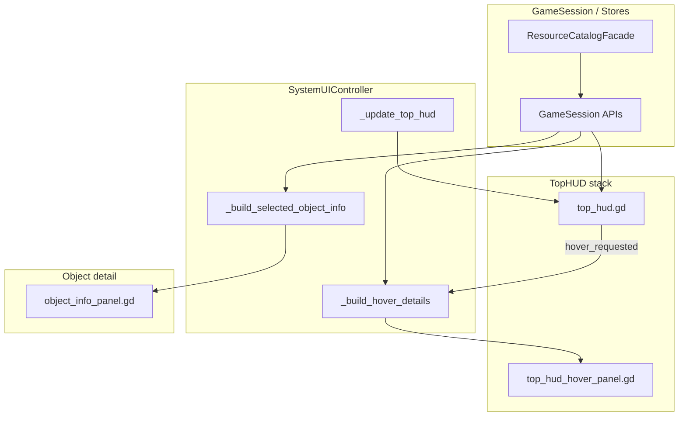

# TopHUD vs ObjectInfo Detail Dedup — Plan v0.1

**Date:** 2026-06-07  
**Scope:** Audit + design only — **no code, scene, or resource changes.**  
**Trigger:** Full Project Cleanup Audit v0.2 (A9 / Medium) — *TopHUD hover vs ObjectInfo dedup*.  
**Verdict:** **PASS WITH NOTES**

---

## 1. Executive summary

TopHUD and ObjectInfoPanel serve **different UI roles** and mostly show **different data domains**:

| UI | Role | Primary data domain |
|----|------|---------------------|
| **TopHUD** (`top_hud.gd`) | Compact fleet/storage summary for the session economy base | Base storage used/cap, fleet totals (drones, ships, probes, jobs) |
| **TopHUD hover** (`system_ui_controller._build_hover_details`) | Expanded breakdown on widget hover | Per-resource storage list, idle vs busy units, per-target assignment lines |
| **ObjectInfoPanel** (`object_info_panel.gd`) | Detail for the **selected world object** | Deposit resources (remaining/total), per-object orbit/automation, action gates/costs |

**True cross-panel duplication is limited.** The clearest duplicate/inconsistency is **base storage resource naming**: TopHUD hover uses `str(res_id).capitalize()`, while ObjectInfo and StoragePanel use `GameSession.get_resource_display_name()` → `ResourceCatalogFacade` → `resource_catalog.tres`.

**Number formatting is already centralized** in `NumberFormat.format_compact()` — shared, not duplicated logic.

**Recommendation for v0.1 implementation:** **Option B** — small shared formatting helpers + fix TopHUD storage hover to use ResourceCatalog display names (and catalog sort order). **Do not** merge UI builders (Option C).

---

## 2. Data-flow overview



**Refresh coupling:** `_update_top_hud()` and `update_object_info()` are often called together from `SystemUIController`, but they **read independent fields** and format locally. There is no shared view-model today.

---

## 3. What each surface shows

### 3.1 TopHUD compact bar (`top_hud.gd`)

| Widget | Source API | Format |
|--------|------------|--------|
| Storage | `GameSession.get_base_storage_used/capacity(bid)` | `"{prefix}{used}/{cap}"` + `NumberFormat.format_compact` |
| Scan drones | `GameSession.get_base_drone_count(bid)` | `"{prefix}{count}"` |
| Mining ships | `GameSession.get_base_mining_ship_count(bid)` | same |
| Colony ships | `GameSession.get_base_colony_ship_count(bid)` | same |
| Survey probes | `set_survey_probe_counts` ← controller | available count only in bar |
| Jobs | `set_jobs_count` ← `automation_controller.get_active_job_count_for_base` | count |

Prefixes (`STR`, `SD:`, `SP:`, …) are **hardcoded in** `scenes/ui/system/top_hud.tscn` and captured at runtime via `_numeric_prefix()`.

### 3.2 TopHUD hover (`_build_hover_details` in `system_ui_controller.gd`)

| Kind | Title (hardcoded) | Details built from | Hint (hardcoded) |
|------|-------------------|--------------------|------------------|
| `storage` | `"Storage"` | `GameSession.get_base_resources` — **only amt > 0** | `"Storage capacity."` |
| `scan_drones` | `"ScanDrones"` | total, idle, per-target lines via `_hover_scan_drone_counts_by_target` | `"Used for scanning unknown objects."` |
| `mining_ships` | `"MiningShips"` | total, idle, per-target via `_hover_mining_ship_counts_by_group_object` | `"Used for automated resource extraction."` |
| `colony_ships` | `"ColonyShips"` | total + `"Status: stored"` | colony hint |
| `survey_probes` | `"Survey Probes"` | available / investigating / total | probe hint |
| `jobs` | `"Jobs"` | active / scanning / mining job counts | jobs hint |

Per-target lines use `_hover_append_simple_object_count_lines`:

```gdscript
"%s: %s" % [_hover_display_name_for_object_id(oid), NumberFormat.format_compact(n)]
```

Object names come from **spawner nodes** (`SystemBody.display_name` / `PointOfInterest.display_name`), else `object_id.capitalize()`.

Upgrade effect blocks appended via `UpgradeDefinition.append_current_tier_effect_block`.

### 3.3 ObjectInfoPanel (`object_info_panel.gd` + controller-built `info` dict)

| Section | Source | Format |
|---------|--------|--------|
| Header meta | `info.display_name`, `body_type`, `scan_state`, `distance_text` | `_meta_label` + `_format_title` / scan state labels from scene templates |
| **Deposit resources** | `info.resources_visible` + `GameSession.get_remaining_resource_amount` | Row label: `GameSession.get_resource_display_name`; amount: `"{remaining} / {total}"` + `NumberFormat` |
| Orbit / automation | `scan_drone_supporting_count`, `active_scan_drone_count`, `assigned_*`, `mining_ship_mining_count` | Scene template prefixes + `_format_count_template` / `NumberFormat` |
| Mining bonus % | **Recalculated in panel** from `drone_supporting * per_drone_pct` | `"+{n}%"` — `info.mining_bonus` from controller is **not used for display** |
| Economy / gates | `system_economy_blocked_reason`, `scan_blocked_reason`, `mine_blocked_reason`, `sensor_pulse_cost_text` | Plain text on `EconomyBlockLabel` |
| Signal block | `SignalInfoSubPanel` (C1) | Separate sub-panel |

ObjectInfo **does not** show base storage totals, fleet-wide idle counts, or survey-probe inventory.

---

## 4. Search findings (grep / read-through)

| Pattern | TopHUD / hover | ObjectInfo | Notes |
|---------|----------------|------------|-------|
| `NumberFormat` | `top_hud.gd`, `_build_hover_details`, `_hover_append_*` | `_apply_automation_status`, `_build_resource_detail_text`, `_format_count_template` | **Shared utility — OK** |
| `ResourceCatalog` / `get_resource_display_name` | **Not used** in hover storage lines | `_resolve_resource_label_for_id` → `GameSession.get_resource_display_name` | **Inconsistency** |
| `display_name` (resources) | `str(res_id).capitalize()` in storage hover | Catalog + `_format_title` fallback | Survey Data vs `Surveydata` risk |
| `display_name` (objects) | `_hover_display_name_for_object_id` (spawner) | `build_scan_info` / body `display_name` in `info` | Same source family when object is spawned; hover also lists **other** targets |
| `storage` | used/cap in bar; resource list in hover | Not shown | Overlaps **StoragePanel**, not ObjectInfo |
| `Drone` / `MiningShip` / `SurveyProbe` | Fleet totals + hover breakdown | Per-selected-object orbit counts | **Complementary aggregation**, partial overlap when selected object appears in hover list |
| Hardcoded EN strings | Hover titles, hints, `"Total:"`, `"No resources stored."` | Scene templates, gate texts from definitions | Intentional EN UI; not shared |

### Related third surface (out of scope but affects dedup picture)

**`storage_panel.gd`** duplicates base-storage presentation with TopHUD:

- Capacity: `"{used} / {cap}"` + `NumberFormat` (+ full-storage suffix)
- Rows: `GameSession.get_resource_display_name` + `get_storage_resource_ids_sorted`

This is the **closest sibling** to TopHUD storage hover, not ObjectInfo.

---

## 5. Duplication matrix

| Info | TopHUD source | ObjectInfo source | Duplicate? | Risk | Recommendation |
|------|---------------|-------------------|------------|------|----------------|
| **Base storage used/cap** | `top_hud.gd` → `get_base_storage_used/capacity` | — | **No** (ObjectInfo N/A) | Low | Document; optional shared `format_storage_used_cap()` with StoragePanel |
| **Base stored resource amounts** | `_build_hover_details("storage")` | — | **No** vs ObjectInfo | — | ObjectInfo shows **deposits**, not base storage |
| **Base resource display names** | `str(res_id).capitalize()` | `GameSession.get_resource_display_name` (deposits) | **Yes (inconsistent)** | **Medium** — `SurveyData` → `"Surveydata"` vs `"Survey Data"` | **Option B:** hover uses `GameSession.get_resource_display_name` + catalog sort |
| **Base resource sort order** | Alphabetical on raw keys | Catalog sort via deposit builder (ObjectInfo rows) | **Partial** | Low | Hover should use `GameSession.get_storage_resource_ids_sorted` like StoragePanel |
| **Deposit remaining/total** | — | `_build_resource_detail_text` | **No** | — | Keep in ObjectInfo only |
| **Fleet total drone count** | `top_hud.gd` | — | **No** | — | — |
| **Drones on selected object** | Hover: all targets; bar: total only | `_apply_automation_status` (this object only) | **Partial overlap** | Low | Intentional summary vs detail; no merge |
| **Fleet total mining ships** | `top_hud.gd` | — | **No** | — | — |
| **Mining ships on selected object** | Hover per-target list | `mining_ship_count_label`, `mine_orbit_label` | **Partial overlap** | Low | Intentional |
| **Mining support bonus %** | — (not in TopHUD) | Panel recalculates; controller also computes `mining_bonus` | **Internal ObjectInfo dup** | **Medium** — two formulas in controller vs panel | Use `info.mining_bonus` for display (separate small task) |
| **Survey probe counts** | TopHUD bar + hover | — | **No** | — | — |
| **Active jobs** | TopHUD hover `jobs` | — | **No** | — | — |
| **Sensor pulse cost text** | — | `sensor_pulse_cost_text` via controller | **No** | — | — |
| **Scan/mine gate blocked text** | — | `EconomyBlockLabel` | **No** | — | — |
| **Number compact formatting** | `NumberFormat.format_compact` | same | **Shared** | None | Keep as-is |
| **Object display name (celestial)** | `_hover_display_name_for_object_id` | `info.display_name` from `build_scan_info` | **Parallel paths** | Low | Optional helper `WorldObjectDisplayNames.for_id(object_id)` — only if drift observed |
| **Empty / fallback text** | `"No resources stored."`, `"—"` title | `"--"`, `_no_description_lore`, `_unknown_display_name_fallback` | **No** (different contexts) | Low | Document; no merge |
| **Cost lines (resource: have / need)** | — | Sensor pulse cost string; not full cost matrix | **No** vs TopHUD | — | Production/Upgrade panels own cost formatting |

---

## 6. Hardcoded strings inventory (relevant excerpts)

### TopHUD hover (`system_ui_controller.gd` ~1473–1597)

- Titles: `Storage`, `ScanDrones`, `MiningShips`, `ColonyShips`, `Survey Probes`, `Jobs`
- Hints: e.g. `Storage capacity.`, `Used for scanning unknown objects.`
- Detail templates: `Total: %s`, `Base: %s`, `Available: %s`, `Investigating: %s`, `Active: %s`, `Scanning: %s`, `Mining: %s`
- Empty: `No resources stored.`, `No base context ID for this system.`
- Colony: `Status: stored`

### ObjectInfo (`object_info_panel.gd` + `.tscn` templates)

- Prefixes from scene labels (`Name:`, `Scan Status:`, orbit templates)
- Amount fallback: `"--"`, `"0 / %s"`
- Lore fallback from `NoDescriptionLoreTemplate`
- Gate/cost strings from controller definitions (not TopHUD)

### ResourceCatalog (`data/resources/resource_catalog.tres`)

- Canonical `display_name` / `short_label` per resource id
- `show_in_top_hud` exists on `ResourceDefinition` but is **`false` for all entries today** — TopHUD does not read catalog flags yet

---

## 7. Option comparison

### Option A — Status quo + documentation

| Pros | Cons |
|------|------|
| Zero regression risk | `SurveyData` / `Iron` naming drift in storage hover persists |
| Matches current architecture | Cleanup audit item stays open |

**Fit:** Acceptable if no player-facing naming bugs observed.

### Option B — Shared formatting helper (recommended)

| Pros | Cons |
|------|------|
| Small, testable diffs | Two call sites minimum (hover + optional StoragePanel) |
| Fixes real ResourceCatalog inconsistency | Does not unify hover vs ObjectInfo builders |
| No UI structure change | — |

**Proposed helpers (new `scripts/ui/formatters/` or methods on existing facades):**

1. **`BaseStorageDisplayFormat`** (static)
   - `format_resource_line(resource_id, amount) -> String` — uses `GameSession.get_resource_display_name` + `NumberFormat.format_compact`
   - `format_used_capacity(used, cap, with_spaces := false) -> String`
   - `build_sorted_storage_detail_lines(base_id) -> Array[String]` — mirrors StoragePanel row logic

2. **TopHUD hover `storage` branch** — replace inline loop with (1); use `get_storage_resource_ids_sorted`.

3. **(Optional, separate ticket)** ObjectInfo mining bonus — display `int(round(info.mining_bonus * 100))` from controller instead of panel-side recomputation.

**Does not move:** hover titles/hints, ObjectInfo orbit templates, fleet aggregation queries.

### Option C — Shared ViewModel builder

| Pros | Cons |
|------|------|
| Single source for all base-summary UI | High churn across `SystemUIController`, TopHUD, StoragePanel |
| Theoretically eliminates drift | ObjectInfo deposit/automation data **does not belong** in base summary VM |
| | Hard to keep presentation-only boundary |

**Fit:** Defer — disproportionate risk for v0.1.

---

## 8. Recommended path (v0.1)

**Choose Option B** with **narrow scope:**

| Step | Change | Files (future) | Risk |
|------|--------|----------------|------|
| **B1** | Storage hover resource lines use catalog names + sort | `system_ui_controller.gd`, new formatter | Low |
| **B2** | Extract `format_used_capacity` (optional) | `top_hud.gd`, `storage_panel.gd`, formatter | Low |
| **B3** | ObjectInfo uses `info.mining_bonus` for label (related, not TopHUD) | `object_info_panel.gd` | Low–medium |

**Explicitly out of scope for this dedup:**

- Merging TopHUD hover with ObjectInfo orbit section
- Moving `_build_hover_details` into ObjectInfo
- Tooltip introduction
- Gameplay / save changes

---

## 9. Smoke requirements (for future implementation)

No TopHUD-specific smokes exist today. Proposed **debug-only** runners:

### 9.1 `top_hud_resource_display_smoke_runner.tscn` (new)

| Test | Assert |
|------|--------|
| A | Load `top_hud.tscn`; `refresh_from_game_session()` with seeded `GameSession` — storage label matches `"{prefix}{compact(used)}/{compact(cap)}"` |
| B | Widget prefixes unchanged (`STR`, `SD:`, …) from scene |
| C | `SAVE_VERSION == 1` |
| D | `tooltip_text` count == 0 |

### 9.2 `top_hud_hover_storage_smoke_runner.tscn` (new)

| Test | Assert |
|------|--------|
| A | `_build_hover_details("storage")` detail lines use **catalog** `display_name` for `SurveyData` → `"Survey Data"` (not `Surveydata`) |
| B | Sort order matches `GameSession.get_storage_resource_ids_sorted` |
| C | Empty base → `"No resources stored."` unchanged |
| D | Regression: hover titles/hints unchanged |

### 9.3 Existing regressions (must stay green)

| Runner | Guards |
|--------|--------|
| `object_info_signal_layout_smoke_runner.tscn` | ObjectInfo layout / signal |
| `object_info_simple_action_button_labels_smoke_runner.tscn` | Scan/Mine labels |
| `object_info_multi_ms_ui_smoke_runner.tscn` | Multi-MS orbit display |
| `sensor_pulse_progress_label_cleanup_smoke_runner.tscn` | Progress label separation |

### 9.4 Cross-cutting

| Check | Expected |
|-------|----------|
| `NumberFormat.format_compact(1234)` | `"1.23K"` (or current contract) |
| `GameSession.get_resource_display_name(&"Iron", "")` | `"Iron"` from catalog |
| `SAVE_VERSION` | `1` |
| `tooltip_text` | `0` project-wide |

---

## 10. Risks

| Risk | Severity | Mitigation |
|------|----------|------------|
| Storage hover name fix changes visible strings | Low–medium | Smoke B with catalog fixtures; screenshot diff optional |
| Shared formatter diverges from StoragePanel | Low | Single builder function used by both |
| Option C over-merge breaks presentation boundaries | High | Reject for v0.1 |
| Mining bonus panel vs controller drift | Medium | B3 + existing stacking smoke |
| `show_in_top_hud` catalog flag unused | Info | Future: filter hover resources by flag |

---

## 11. Akzeptanz (this audit task)

| Kriterium | Status |
|-----------|--------|
| Dedupe-Stellen klar dokumentiert | ✓ |
| Kein Code geändert | ✓ |
| Kein UI geändert | ✓ |
| Empfehlung klein und testbar (Option B) | ✓ |
| PASS / PASS WITH NOTES / FAIL | **PASS WITH NOTES** |

**Notes:**

1. TopHUD ↔ ObjectInfo overlap is **smaller than audit wording suggests**; largest dup is **TopHUD storage hover ↔ StoragePanel**, sharing the same inconsistency pattern as ObjectInfo resource naming.
2. `ResourceDefinition.show_in_top_hud` is defined but unused — document for future filtering, not v0.1.
3. No TopHUD smokes exist yet — implementation must add runners in §9.

---

## 12. Nächste sichere Implementierung

1. Add `BaseStorageDisplayFormat` (or extend `ResourceCatalogFacade` with display line builders).
2. Patch `_build_hover_details("storage")` only — **one function, one smoke**.
3. Run §9.1–9.3 + existing ObjectInfo smokes.
4. Optionally B2/B3 as follow-up PRs.

**Estimated touch surface:** 1 new script (~40 lines), 1 controller function block, 2 new smoke files — **no `.tscn` edits required** for B1.
