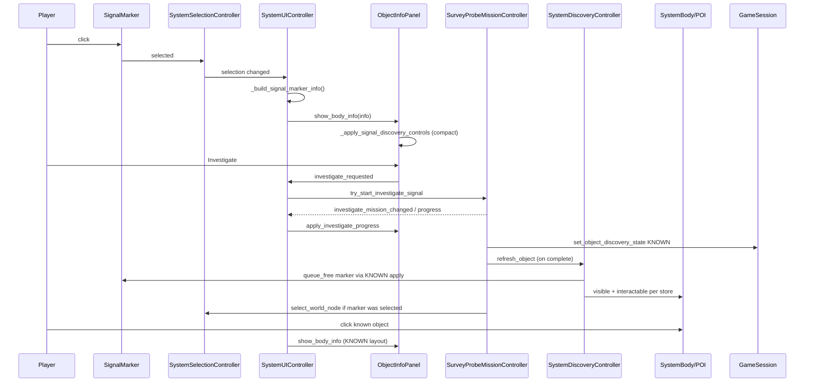

# ObjectInfoPanel Signal Layout v0.1

Documentation-only reference for how `ObjectInfoPanel` adapts its layout between **discovery signal** selection (`SignalMarker`) and **known** world objects (`SystemBody`, `PointOfInterest`, established base). Describes current behavior as of Godot 4.6.1; does not prescribe implementation changes.

---

## Purpose

`ObjectInfoPanel` (`scenes/ui/system/object_info_panel.tscn`, `scripts/ui/system/object_info_panel.gd`) is a single shared panel that shows different UI states depending on selection:

| Selection | Entry API | Notes |
|-----------|-----------|--------|
| **SIGNAL** | `show_body_info(info)` via `SignalMarker` | Discovery placeholder; not a scannable/minable body |
| **KNOWN object** | `show_body_info(info)` via `SystemBody` / scanned body | Full scan/mine/automation UI |
| **POI** | `show_poi_info(info)` → same `_apply_info()` | Same layout rules as KNOWN when not a signal |
| **Base / Earth** | `show_body_info(info)` with `is_home_base` | KNOWN layout + **Sensor Pulse** on base only |
| **Empty selection** | `show_empty()` | Panel hidden by `SystemUIController`; internal empty state |

A **signal** is not the real world object. `SystemDiscoveryController` keeps the body/POI hidden (`DISCOVERY_SIGNAL`) and spawns a clickable `SignalMarker` at the same `object_id`. The panel must therefore **not** show resource lists, scan/mine actions, or orbit automation rows as if the object were already known.

Scan, mine, investigate gates, and discovery state are computed in `GameSession`, `SurveyProbeMissionController`, and `SystemUIController._build_selected_object_info()` / `_build_signal_marker_info()`. The panel **displays** the resulting `Dictionary` and toggles layout; it does not re-derive gameplay rules.

---

## Design Rules

| Rule | Meaning |
|------|---------|
| **HIDDEN** (`DISCOVERY_HIDDEN`) | World object not interactable; no marker; panel not involved |
| **SIGNAL** (`DISCOVERY_SIGNAL`) | `SignalMarker` selectable; real `SystemBody` / `PointOfInterest` hidden |
| **SIGNAL UI** | Unknown-style meta + lore/info + Investigate (+ progress); **no** resource section |
| **KNOWN** | Real object visible and selectable; normal panel (resources, scan/mine, orbit, colonization as applicable) |
| **Scan / Mine** | Gates apply to **known** `object_id` on world nodes; `SystemUIController` skips scan/mine dict fields for `SignalMarker` |
| **Panel role** | Presentation + button signals; gates stay upstream |

---

## SIGNAL Layout Behavior

Triggered when `info["is_discovery_signal"] == true` (set in `SignalMarker.build_signal_info()`).

### Orchestration

1. `_apply_info()` fills labels, lore, cache; calls `_apply_signal_discovery_controls()` then `_apply_live_action_controls()`.
2. `_apply_live_action_controls()` sees `is_discovery_signal`, calls `_set_action_buttons(false, …)` (hides scan/mine), `_set_recall_buttons(false, …)`, `_apply_colonization_controls()`, then `_apply_signal_discovery_controls()` again.
3. `_apply_signal_discovery_controls()` calls `_set_resource_section_visible(false)` and `_apply_signal_panel_layout(true)`.

There is **no** separate `_reset_signal_panel_layout()` function. Returning to KNOWN uses `_apply_signal_panel_layout(false)` inside the same function, which calls `_restore_known_lore_layout()`.

### Nodes hidden or collapsed (SIGNAL)

| Node / area | Mechanism |
|-------------|-----------|
| **DividerB** | `_set_resource_section_visible(false)` → `visible = false` |
| **ResourceTitleLabel** | same |
| **ResourcePanel** (incl. `ResourceMargin`, `ResourceScroll`, `ResourceList`) | same; `custom_minimum_size = Vector2.ZERO` in `_apply_signal_panel_layout(true)` |
| **DividerD** | `_apply_signal_panel_layout(true)` → `visible = false` |
| **OrbitStatusSection** | `_apply_signal_panel_layout(true)` → entire section `visible = false` |
| **DroneOrbitLabel**, **MineOrbitLabel**, **MiningBonusLabel** | Also forced `visible = false` in `_apply_signal_discovery_controls()` (redundant with section hide) |
| **ScanWithDroneButton** | `_set_action_buttons` with `show_scan = false` |
| **SendMiningShipButton** | `mine_visible = false` |
| **RecallDroneButton**, **RecallMiningShipButton** | `_set_recall_buttons(false, false)` |
| **SensorPulseButton** | Not home base → hidden in `_apply_live_action_controls()` |
| **SensorPulseProgressLabel** | Not used on signals; remains hidden |
| **InvestigateButton** | Hidden while `investigate_in_progress` |
| **ColonizationButton** | Typically hidden: signal `build_signal_info()` does not set colonization flags (defaults false) |

Resource rows: `_apply_resources()` runs with empty `resources_visible`; section visibility still hides chrome so VBox does not reserve editor minimum heights.

### Nodes that stay visible (SIGNAL)

| Node / area | Role |
|-------------|------|
| **HBoxContainer** / **HeaderLabel**, **CloseBasePanelButton** | Panel chrome |
| **DividerA** | After header (unchanged) |
| **MainRow** / **PreviewPanel**, **PreviewTexture** | Preview often `null` on signal |
| **NameLabel**, **TypeLabel**, **ScanStatusLabel**, **DistanceLabel** | Meta; distance updated live via `set_distance_text()` from `SystemUIController._process()` |
| **DividerC**, **LoreTitleLabel** (“Info”), **LorePanel**, **LoreScroll**, **LoreTextLabel** | Signal lore (unknown template or active-investigate text from controller) |
| **EconomyBlockLabel** | Blocked investigate reason, discovery complete message, or hidden during progress |
| **InvestigateButton** | When not in progress; disabled when gate blocks |
| **InvestigateProgressLabel** | During investigate (`_show_investigate_progress_ui`) |
| **GridContainer** | Hosts action buttons; only Investigate (and rarely colonization) relevant |

**SensorPulseProgressLabel** belongs to **home base** KNOWN flow (`_apply_sensor_pulse_controls()`), not signal selection.

### Compact height (SIGNAL-specific)

`_apply_signal_panel_layout(true)` plus `_fit_signal_lore_text_height()` shrink the panel so hidden controls do not leave empty VBox gap:

- Panel `custom_minimum_size.y` driven toward content (`0` then `_queue_panel_layout_refresh` sets `offset_bottom` from combined minimum size).
- Lore: disable scroll, set label/panel minimum heights from wrapped text.
- `root_vbox.queue_sort()`, `reset_size()`, `update_minimum_size()`.

---

## KNOWN Layout Behavior

When `is_discovery_signal` is false after `_apply_info()` / `show_empty()`:

| Area | Behavior |
|------|----------|
| **Resource section** | `_set_resource_section_visible(true)`; rows from `resources_visible` via `_apply_resources()` / `_refresh_resource_rows_from_cache()` |
| **DividerD**, **OrbitStatusSection** | Restored visible; orbit lines driven by `_apply_automation_status()` |
| **Scan / Mine** | `_apply_live_action_controls()` uses `GameSession` gate fields on the info dict (`show_scan_with_drone`, `can_scan_with_drone`, `show_mine_with_ship`, …) |
| **Depleted mining** | `mining_exhausted` / `KEY_MINE_DEPLETED` → depleted button text + economy block |
| **Home base** | `_apply_sensor_pulse_controls()` for **SensorPulseButton** / **SensorPulseProgressLabel** |
| **Colonization** | `_apply_colonization_controls()` when dict flags set |
| **Lore** | `_restore_known_lore_layout()` restores editor scroll/min sizes; panel uses taller scene defaults |

Scene instance in `system_scene.tscn` uses a fixed anchor box (`offset_bottom` ≈ 380). KNOWN content fits that editor-oriented height; SIGNAL relies on runtime shrink because the same scene is sized for full object info.

---

## Runtime Layout Reason

**Why code instead of two scenes?**

- One `ObjectInfoPanel` scene was built for full **known** objects (resources, orbit block, scan/mine grid, lore scroll with minimum heights).
- **Signals** need a short stack: meta + info + investigate only.
- In Godot 4, `visible = false` removes controls from interaction but **VBoxContainer** can still reserve `custom_minimum_size` from the editor (e.g. `ResourcePanel` 50px, `LorePanel` 80px) unless sizes are cleared and re-measured.

**Techniques used**

| Technique | Where |
|-----------|--------|
| `visible` toggles | `_set_resource_section_visible`, `_apply_signal_panel_layout`, buttons |
| `custom_minimum_size` save/restore | `_capture_known_layout_sizes()`, `_restore_known_lore_layout()`, signal branch zeros |
| `update_minimum_size()` | Lore fitting, panel refresh |
| `get_combined_minimum_size()` | `_fit_signal_lore_text_height()` for wrapped label height |
| `root_vbox.queue_sort()`, `reset_size()` | `_queue_panel_layout_refresh()` |
| `offset_bottom` adjustment | SIGNAL branch sets height from measured content |

**Godot 4 notes**

- `minimum_size_changed` is a **signal** on `Control`, not a method to call.
- `Label` has no `get_content_height()`; use `get_combined_minimum_size()` / `get_minimum_size()` after `update_minimum_size()` with autowrap.

---

## Responsible Functions

All in `scripts/ui/system/object_info_panel.gd` unless noted.

| Function | Role |
|----------|------|
| `show_body_info(info)` | Public; delegates to `_apply_info()` (signals + bodies) |
| `show_poi_info(info)` | Public; same `_apply_info()` |
| `show_empty()` | Clears selection UI; resets cache; `_apply_signal_discovery_controls()` |
| `_apply_info(info)` | Main bind: labels, resources, lore, `_live_action_cache`, discovery + action controls |
| `_apply_signal_discovery_controls()` | Signal vs known: resource visibility, layout mode, Investigate UI, economy block for signal |
| `_apply_signal_panel_layout(is_signal: bool)` | Toggle resource/orbit dividers; signal shrink vs known restore |
| `_restore_known_lore_layout()` | KNOWN lore scroll/panel/text minimum sizes (not a separate “reset signal” API) |
| `_set_resource_section_visible(visible: bool)` | **DividerB**, **ResourceTitleLabel**, **ResourcePanel** |
| `_fit_signal_lore_text_height()` | Compact lore block for SIGNAL |
| `_queue_panel_layout_refresh(is_signal: bool)` | VBox sort + panel height |
| `_capture_known_layout_sizes()` | `_ready()` snapshot for restore |
| `_apply_live_action_controls()` | Scan/mine/recall/colonization/sensor pulse; early signal branch |
| `_apply_sensor_pulse_controls()` | Base-only sensor pulse |
| `_apply_colonization_controls()` | Colony button + no-ship block text |
| `_apply_resources()` / `_apply_lore()` / `_apply_automation_status()` | Data display (automation hidden again for signal) |
| `_show_investigate_progress_ui()` / `_hide_investigate_progress_ui()` | **InvestigateProgressLabel** |
| `_show_sensor_pulse_progress_ui()` / `_hide_sensor_pulse_progress_ui()` | Base pulse only |
| `apply_investigate_progress(progress)` | Live progress from controller |
| `set_distance_text(value_text)` | Distance meta line |

**Upstream (`scripts/system/controller/system_ui_controller.gd`)**

| Function | Role |
|----------|------|
| `update_object_info()` | Selection → `show_body_info` / `show_poi_info` / hide panel |
| `_build_selected_object_info()` | Routes `SignalMarker` → `_build_signal_marker_info()` |
| `_build_signal_marker_info()` | Investigate gates + progress fields on marker dict |
| `_process()` | `set_distance_text()` while panel visible |
| `_on_investigate_requested()` | Starts `SurveyProbeMissionController.try_start_investigate_signal()` |
| `_on_investigation_progress_changed()` | `object_info_panel.apply_investigate_progress()` |

**Discovery world (`scripts/system/controller/system_discovery_controller.gd`)**

| Function | Role |
|----------|------|
| `_apply_discovery_to_world_object()` | HIDDEN / SIGNAL / KNOWN visibility + marker spawn |
| `_spawn_or_refresh_marker()` | Instantiates `SignalMarker` |
| `refresh_object()` | Reads store state; applies KNOWN/SIGNAL/HIDDEN — removes marker and shows real object when KNOWN |

**Marker data (`scripts/system/signal_marker.gd`)**

| Function | Role |
|----------|------|
| `build_signal_info()` | Panel dict with `is_discovery_signal: true`, empty resources, scan unknown |

---

## Data Flow

1. Player selects **SignalMarker** (real object hidden).
2. **SystemSelectionController** reports selection; **SystemUIController.update_object_info()** builds dict.
3. **SignalMarker.build_signal_info()** + `_build_signal_marker_info()` add investigate fields.
4. **ObjectInfoPanel.show_body_info()** → `_apply_info()` → SIGNAL layout.
5. **Investigate** → `investigate_requested` → **SurveyProbeMissionController**.
6. Progress → `_on_investigation_progress_changed()` → `apply_investigate_progress()`.
7. On complete, **GameSession** sets discovery **KNOWN**; **SystemDiscoveryController.refresh_object()** applies visibility (marker removed, real object shown). **SurveyProbeMissionController** may transfer selection to the world node if the marker was selected; otherwise selection may clear when marker is freed.
8. Player selects revealed **SystemBody** / **POI** → normal KNOWN panel with scan/mine/resources.

---

## Known Risks

| Risk | Detail |
|------|--------|
| **Maintenance** | Layout split across visibility, minimum sizes, and `offset_bottom`; easy to break when reordering `Margin/Root` children in `.tscn` |
| **Node renames** | `@onready` paths in `object_info_panel.gd` break silently or at load |
| **Signal → KNOWN transition** | Must run `_apply_signal_panel_layout(false)` and `_restore_known_lore_layout()` or stale zero sizes / hidden **DividerD** persist |
| **Lore clipping** | `_fit_signal_lore_text_height()` depends on wrap width; resize or theme changes can clip long text |
| **Fixed scene height** | `system_scene.tscn` ObjectInfoPanel anchor height suits KNOWN; SIGNAL depends on shrink logic |
| **Double automation hide** | `_apply_automation_status()` may set orbit labels visible, then signal path hides them again — order matters |

---

## Do Not Change Casually

- `GameSession` discovery / scan state (`DISCOVERY_HIDDEN`, `DISCOVERY_SIGNAL`, KNOWN)
- `ObjectScanStore` and scan layer unlock rules
- `GameSession.can_scan_object()` / `can_mine_object()` and gate text keys
- `SurveyProbeMissionController` investigate flow
- `remaining_resources` live updates (`object_remaining_resources_changed`)
- Save/load discovery fields
- `AutomationController` orbit counts fed into info dict
- **ObjectInfoPanel** node names under `Margin/Root` without updating `@onready` paths
- Reintroducing `tooltip_text` (project policy: zero tooltips)

---

## Future Improvement

Preferred direction (not scheduled; no big-bang):

1. **SignalInfoSection** subscene — compact meta + lore + investigate only; editor layout.
2. **KnownObjectInfoSection** subscene — resources, orbit, scan/mine grid.
3. **ObjectInfoPanel** as host — show/hide sections instead of per-node minimum-size surgery.
4. Keep gates in **GameSession** / controllers; sections remain dumb views.

Migrate only after manual UI regression (signal, investigate, reveal, known depleted, base sensor pulse).

---

## Smoke Test

Manual checks in system scene:

- [ ] Select **signal** → compact panel; **no** Visible Resources block (**DividerB** / **ResourceTitleLabel** / **ResourcePanel** hidden).
- [ ] **Investigate** starts → **InvestigateProgressLabel** visible; still no resource section.
- [ ] After **reveal**, select real object → resource section and scan/mine behave as before.
- [ ] Known body with resources → rows and amounts update.
- [ ] **Depleted** mine → depleted button / block text.
- [ ] **Base/Earth** → **SensorPulseButton** / progress; not on signal.
- [ ] **Empty selection** → panel hidden; no errors.
- [ ] `grep tooltip_text` → 0 hits in `*.gd` / `*.tscn` / `*.tres`.
- [ ] No red runtime errors when switching signal ↔ known ↔ empty.

---

## Related Files

| File | Relevance |
|------|-----------|
| `scripts/ui/system/object_info_panel.gd` | Layout implementation |
| `scenes/ui/system/object_info_panel.tscn` | Node tree and editor minimum sizes |
| `scripts/system/controller/system_ui_controller.gd` | Info dict, distance, investigate wiring |
| `scripts/system/signal_marker.gd` | Signal info dict |
| `scripts/system/controller/system_discovery_controller.gd` | Marker spawn; `refresh_object` / store-driven apply |
| `scenes/system/system_scene.tscn` | Panel placement and anchor height |
